# Agent System

This page documents the multi-agent orchestration system, including Plan Agent, Build Agent, and custom agent capabilities.

## Overview

Emacs-Agent uses a **multi-agent architecture** where specialized agents handle different aspects of software development tasks.


## Agent Types

### 1. Plan Agent

**Purpose:** Analysis and planning (read-only operations)

**Capabilities:**
- Analyze code structure and dependencies
- Create implementation plans
- Identify potential issues
- Suggest architectural improvements
- Generate task breakdowns

**Restrictions:**
- Cannot modify files
- Cannot execute write tools
- Cannot run shell commands
- Read-only LSP and git operations only

**Example Use Cases:**
- "Analyze the authentication system"
- "Plan how to implement caching"
- "Review code structure for performance issues"

### 2. Build Agent

**Purpose:** Code modification and implementation

**Capabilities:**
- Modify files (write, edit, delete)
- Create new files and directories
- Execute tests and build commands
- Make git commits
- Use Plan Agent's analysis

**Workflow:**
- Receives plan from Plan Agent (or creates own)
- Implements changes incrementally
- Tests each change
- Commits working code

**Example Use Cases:**
- "Implement user authentication"
- "Fix the performance bug in query handler"
- "Refactor the database layer"

### 3. Custom Agents

**Purpose:** Specialized domain-specific tasks

**Examples:**
- **Test Agent** - Generate and run tests
- **Docs Agent** - Update documentation
- **Refactor Agent** - Code cleanup and refactoring
- **Security Agent** - Security audit and fixes

**Configuration:**
```rust
struct CustomAgent {
    name: String,
    description: String,
    allowed_tools: Vec<String>,
    system_prompt: String,
    model: String,
}
```

## Agent State Machine

Each agent follows a state machine during execution:


### State Descriptions

| State | Description | SSE Event |
|-------|-------------|-----------|
| **Idle** | Waiting for user input | `agent.state: idle` |
| **Thinking** | LLM generating response | `agent.state: thinking` |
| **Streaming** | Streaming response text | `message.delta` |
| **ToolExecution** | Executing tool call | `agent.state: tool_execution` |
| **WaitingApproval** | Waiting for user approval | `agent.state: waiting_approval` |
| **ExecutingTool** | Tool is running | `tool.progress` |
| **Error** | Error occurred | `agent.state: error` |

## Multi-Agent Workflows

### Plan-Then-Build Pattern

The most common workflow involves Plan Agent analyzing first, then Build Agent implementing:


### Parallel Agent Pattern

Multiple agents work on different aspects simultaneously:


### Iterative Refinement Pattern

Agent iteratively improves code based on feedback:

```mermaid
sequenceDiagram
    participant Agent
    participant Tools
    participant Tests

    Agent->>Tools: Implement feature
    Tools-->>Agent: Done

    loop Until tests pass
        Agent->>Tests: Run tests
        Tests-->>Agent: Failures

        Agent->>Agent: Analyze failures
        Agent->>Tools: Fix issues
        Tools-->>Agent: Updated
    end

    Agent->>Tests: Run tests
    Tests-->>Agent: All pass ✓
```



## Agent Configuration

### Plan Agent Configuration

```rust
struct PlanAgentConfig {
    model: "claude-sonnet-4.5",
    allowed_tools: vec![
        // Read-only filesystem
        "read_file",
        "search_files",
        "list_directory",

        // Git read-only
        "git_status",
        "git_diff",
        "git_log",

        // LSP
        "diagnostics",
        "symbols",
        "definition",
        "references",
    ],
    system_prompt: "You are a code analysis agent. Your job is to analyze code and create detailed implementation plans. You cannot modify any files - only read and analyze.",
    max_tokens: 8192,
}
```

### Build Agent Configuration

```rust
struct BuildAgentConfig {
    model: "claude-sonnet-4.5",
    allowed_tools: vec![
        // All filesystem tools
        "read_file", "write_file", "edit_file", "delete_file",
        "search_files", "list_directory", "create_directory",

        // Git operations
        "git_status", "git_diff", "git_commit", "git_branch",

        // Shell
        "shell_exec",

        // LSP
        "diagnostics", "symbols",
    ],
    system_prompt: "You are a code implementation agent. Your job is to implement features and fix bugs based on plans. Always test your changes.",
    max_tokens: 8192,
    use_plan_agent: true, // Can invoke Plan Agent
}
```

### Custom Agent Example

```rust
let test_agent = CustomAgent {
    name: "test-agent",
    description: "Generates and runs tests",
    model: "claude-sonnet-4.5",
    allowed_tools: vec![
        "read_file",
        "write_file", // Only for test files
        "shell_exec", // To run tests
        "diagnostics",
    ],
    system_prompt: "You are a test generation agent. Create comprehensive tests with good coverage. Run tests to ensure they pass.",
    constraints: AgentConstraints {
        max_tokens: 4096,
        write_paths: vec![
            "tests/**",
            "**/*_test.rs",
            "**/*.test.ts",
        ],
        read_only: false,
    },
};
```

## Agent Orchestration

### Orchestrator Architecture


### Orchestrator Implementation

```rust
struct AgentOrchestrator {
    agents: HashMap<String, Box<dyn Agent>>,
    active_sessions: HashMap<Uuid, SessionState>,
    context_manager: ContextManager,
}

impl AgentOrchestrator {
    async fn handle_request(&mut self, session_id: Uuid, request: Request) -> Result<Response> {
        // 1. Determine which agent to use
        let agent_type = self.select_agent(&request);

        // 2. Get or create session state
        let state = self.active_sessions
            .entry(session_id)
            .or_insert_with(|| SessionState::new());

        // 3. Prepare context
        let context = self.context_manager
            .build_context(session_id, &request)?;

        // 4. Execute with selected agent
        let agent = self.agents.get_mut(&agent_type)
            .ok_or("Agent not found")?;

        let response = agent.execute(request, context).await?;

        // 5. Update state
        state.update(&response);

        Ok(response)
    }

    fn select_agent(&self, request: &Request) -> String {
        // Simple heuristics for agent selection
        if request.text.contains("analyze") || request.text.contains("plan") {
            "plan-agent".to_string()
        } else if request.text.contains("implement") || request.text.contains("fix") {
            "build-agent".to_string()
        } else if request.text.contains("test") {
            "test-agent".to_string()
        } else {
            "build-agent".to_string() // Default
        }
    }
}
```

## Context Management

### Context Window

Each agent maintains context including:

```rust
struct AgentContext {
    // Conversation history
    messages: Vec<Message>,

    // Tool call history
    tool_calls: Vec<ToolCall>,

    // File context
    open_files: HashMap<String, FileContent>,

    // Project context
    project_path: PathBuf,
    git_status: GitStatus,
    diagnostics: Vec<Diagnostic>,

    // Agent-specific context
    plan: Option<ImplementationPlan>, // For Build Agent
    analysis: Option<CodeAnalysis>,   // From Plan Agent
}
```

### Context Optimization

To fit within token limits, context is prioritized:


## Agent Communication

Agents can communicate with each other:


### Inter-Agent Messages

```rust
enum AgentMessage {
    RequestPlan { feature: String },
    ProvidePlan { plan: ImplementationPlan },
    RequestReview { changes: Vec<FileChange> },
    ProvideReview { feedback: ReviewFeedback },
    RequestTests { module: String },
    ProvideTests { tests: Vec<TestCase> },
}
```

## Error Handling

### Agent Error Recovery


### Error Types and Responses

| Error Type | Response | Recovery |
|------------|----------|----------|
| **Tool execution failure** | Inform LLM, suggest alternative | Retry with different params |
| **LLM API rate limit** | Exponential backoff | Wait and retry |
| **Permission denied** | Inform user | Request approval |
| **File not found** | Inform LLM | LLM corrects path |
| **Network error** | Retry with backoff | Up to 4 attempts |
| **Out of context** | Compress context | Summarize old messages |

## Performance Optimization

### Agent Caching

Agents cache common operations:

```rust
struct AgentCache {
    // File content cache
    files: LRUCache<String, String>,

    // Tool result cache (for read-only tools)
    tool_results: LRUCache<String, ToolResult>,

    // Analysis cache
    code_analysis: LRUCache<String, Analysis>,
}
```

### Parallel Execution

Multiple agents can run in parallel:

```rust
async fn execute_parallel_agents(tasks: Vec<AgentTask>) -> Vec<AgentResult> {
    let futures: Vec<_> = tasks
        .into_iter()
        .map(|task| {
            let agent = get_agent(&task.agent_type);
            agent.execute(task)
        })
        .collect();

    futures::future::join_all(futures).await
}
```

## Monitoring and Observability

### Agent Metrics

```rust
struct AgentMetrics {
    total_requests: u64,
    successful_requests: u64,
    failed_requests: u64,
    avg_response_time_ms: f64,
    avg_tokens_used: f64,
    tool_calls_count: u64,
}
```

### Agent Events

Agents emit events for monitoring:

```rust
enum AgentEvent {
    Started { agent_type: String, task: String },
    Thinking { progress: String },
    ToolCallRequested { tool: String },
    ToolCallCompleted { tool: String, duration_ms: u64 },
    ResponseGenerated { tokens: usize },
    Completed { duration_ms: u64, outcome: Outcome },
    Failed { error: String },
}
```

## Related Pages

- [Architecture Overview](Architecture-Overview) - System architecture
- [Tool System](Tool-System) - Tool execution and approval
- [MCP Integration](MCP-Integration) - Tool protocol
- [Communication Protocol](Communication-Protocol) - HTTP/SSE API
- [Rust Backend](Rust-Backend) - Backend implementation

## External Resources

- [Multi-Agent Systems](https://en.wikipedia.org/wiki/Multi-agent_system)
- [LLM Agent Patterns](https://www.anthropic.com/index/building-effective-agents)
- [Claude Sonnet Documentation](https://docs.anthropic.com/claude/docs)
