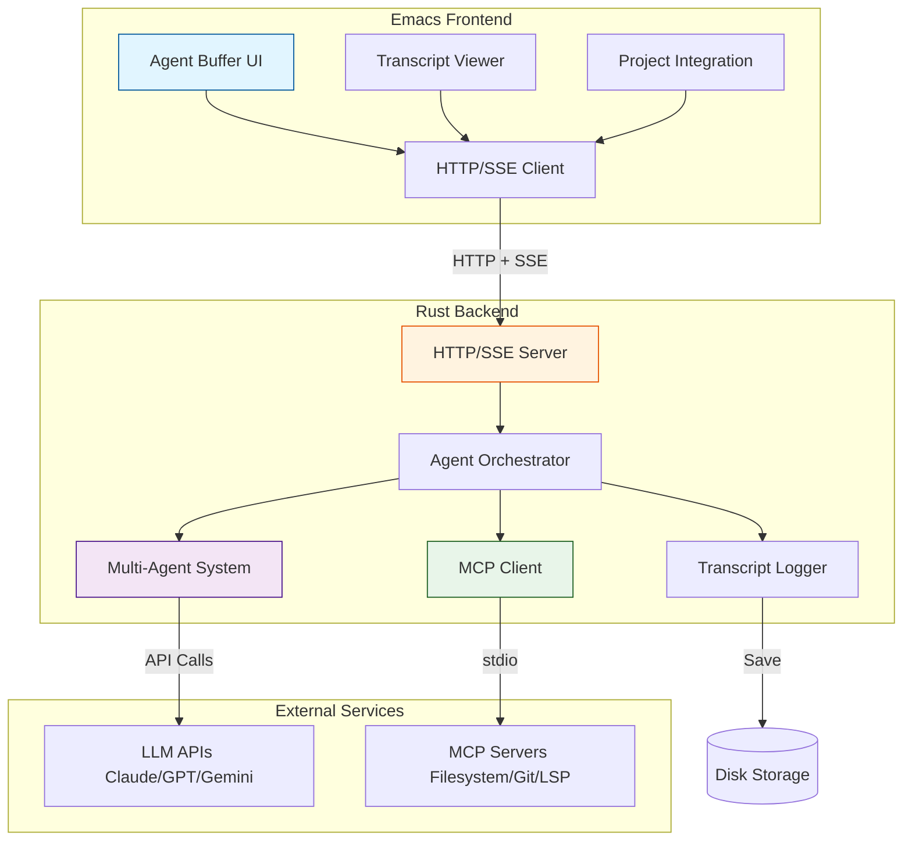
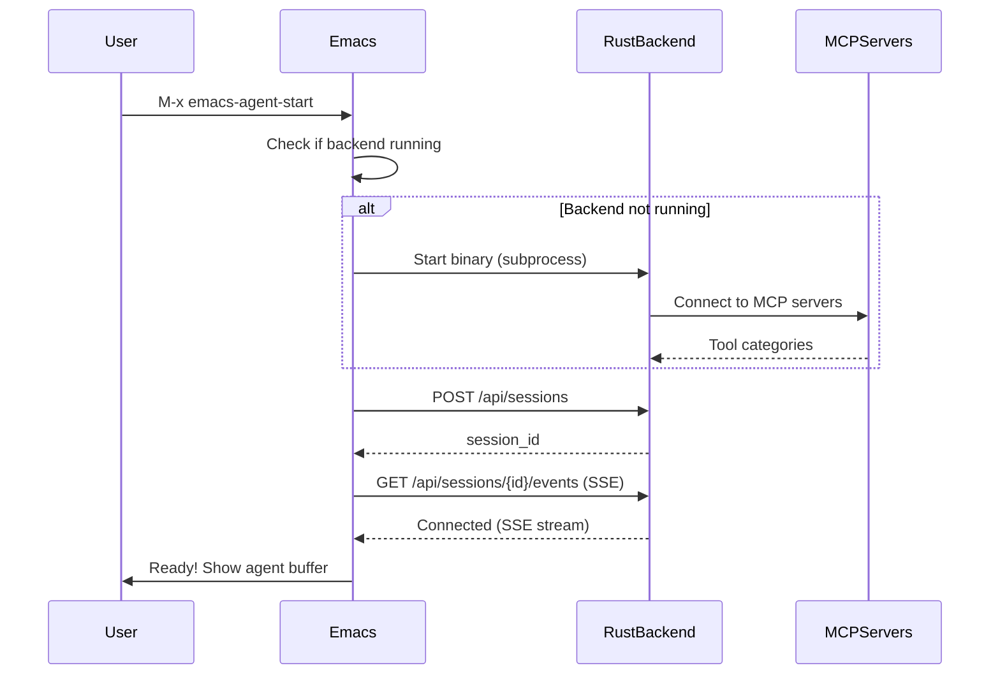
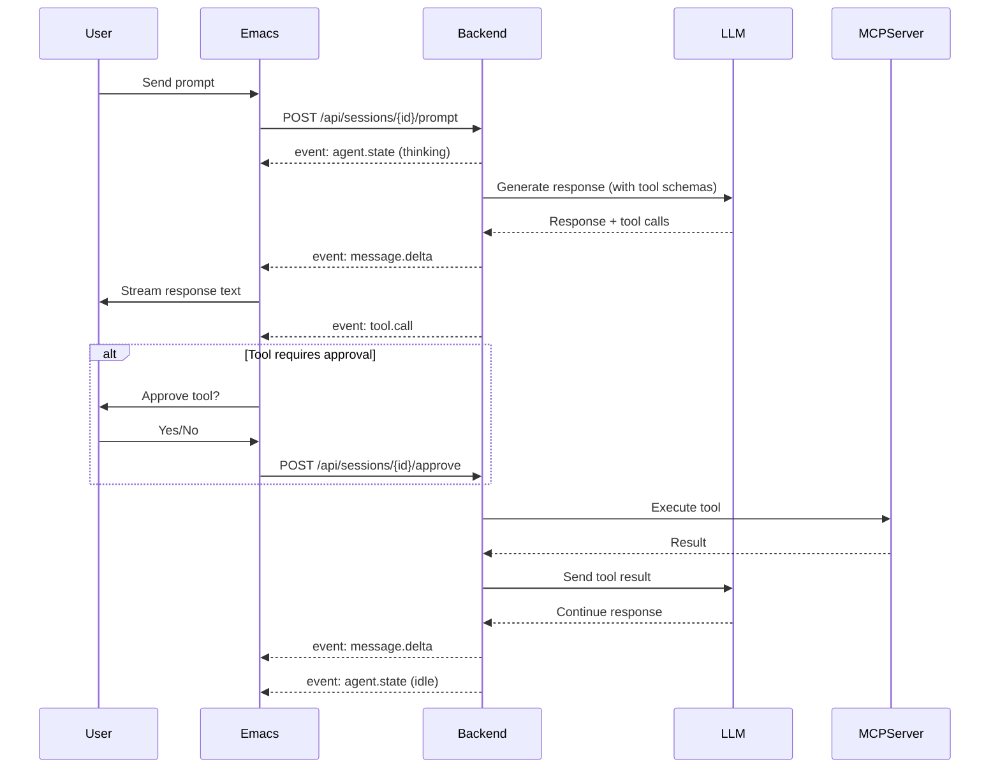
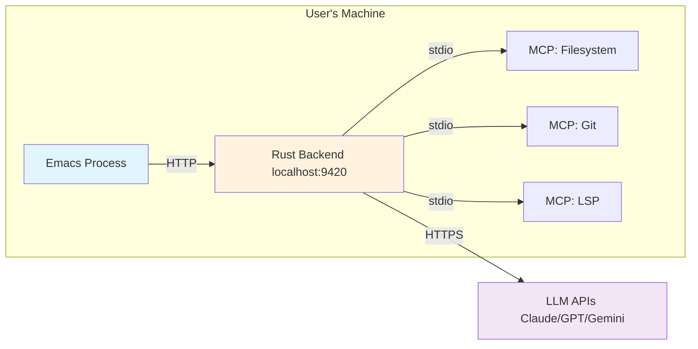
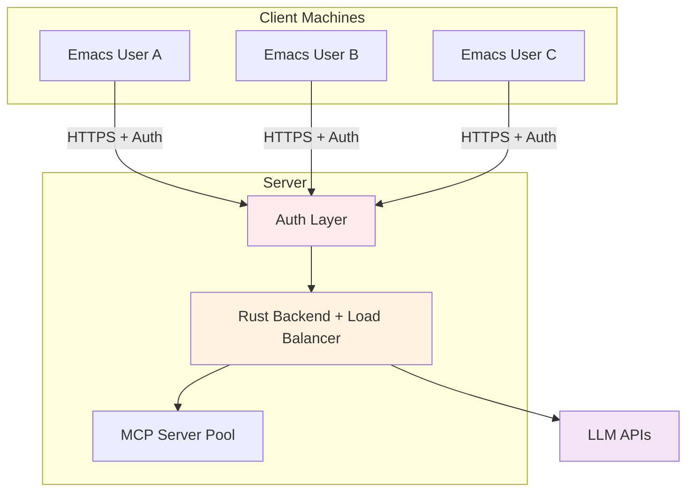
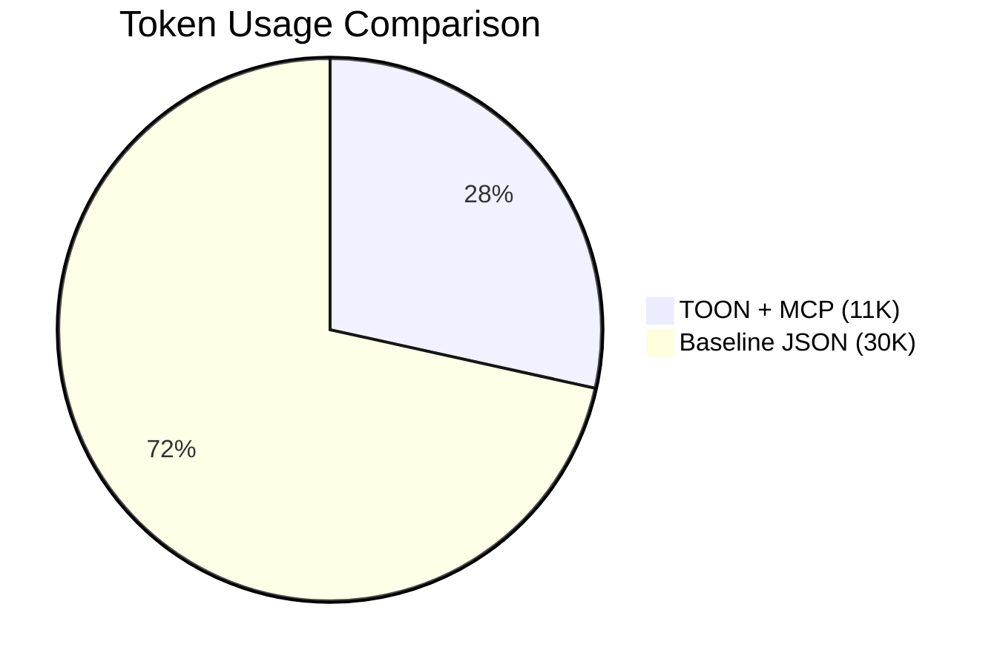
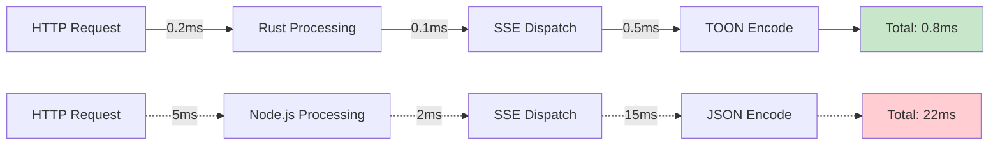

# Architecture Overview

This page provides a high-level overview of the Emacs-Agent system architecture.

## System Architecture

Emacs-Agent follows a **client-server architecture** with a clean separation between the Emacs frontend (UI/UX layer) and the Rust backend (agent logic and tool execution).

### High-Level Architecture Diagram

## Core Components

### 1. Emacs Frontend

The **Emacs frontend** provides the user interface and integrates seamlessly with the Emacs ecosystem.

**Components:**
- **Agent Buffer** - Main conversation UI
- **Transcript Viewer** - Browse past sessions in org-mode
- **Project Integration** - Works with projectile/project.el
- **HTTP/SSE Client** - Communicates with Rust backend

**Technology:**
- Emacs Lisp
- Built-in libraries: `url`, `json`, `org`
- Optional: `projectile`, `magit`

See: [Emacs Frontend](Emacs-Frontend) for details

### 2. Rust Backend

The **Rust backend** handles all agent logic, tool execution, and LLM communication.

**Components:**
- **HTTP/SSE Server** - REST API and event streaming
- **Agent Orchestrator** - State machine and workflow coordination
- **Multi-Agent System** - Plan, Build, and Custom agents
- **MCP Client** - Connects to MCP servers with TOON optimization
- **Transcript Logger** - Saves sessions in JSON/Markdown/Org-mode

**Technology:**
- Rust 1.75+
- axum or actix-web (HTTP server)
- tokio (async runtime)
- serde_json, toon-rs (serialization)

See: [Rust Backend](Rust-Backend) for details

### 3. Communication Layer

**HTTP REST API** for commands and control:
- Session management
- Prompt submission
- Tool approval/rejection

**Server-Sent Events (SSE)** for real-time streaming:
- Message deltas (streaming responses)
- Tool call notifications
- File change events
- Agent state updates

See: [Communication Protocol](Communication-Protocol) for details

### 4. MCP Integration

**Model Context Protocol (MCP)** enables extensible tool systems.

**Features:**
- **Hierarchical tool organization** - Load only relevant categories
- **Lazy loading** - Fetch tool schemas on-demand
- **TOON format** - 30-60% token reduction
- **OAuth 2.1** - Secure authorization

**MCP Servers:**
- Filesystem tools (read, write, search)
- Git operations (commit, branch, status)
- LSP integration (diagnostics, symbols)
- Custom tools (extensible)

See: [MCP Integration](MCP-Integration) for details

## Data Flow

### Session Startup Flow

### Prompt Execution Flow

## Design Principles

### 1. Separation of Concerns

**Emacs Frontend:**
- Focus on UX and Emacs integration
- Minimal logic - delegate to backend
- Easy to maintain and extend

**Rust Backend:**
- All agent logic and complexity
- Type-safe, testable, performant
- Can support multiple frontends

### 2. Performance First

**Why Rust?**
- 10-100x faster than Node.js for agent operations
- Memory-safe without garbage collection
- Excellent async/concurrency support
- Single binary distribution

**Why TOON?**
- 30-60% token reduction for tool definitions
- Better LLM accuracy (73.9% vs 69.7%)
- Human-readable format

### 3. Persistent Context

**Problem:** Claude Code deletes chat history during context compression

**Solution:** Emacs-Agent saves ALL conversations to disk:
- JSON (canonical format)
- Markdown (human-readable)
- Org-mode (Emacs native)

**Benefits:**
- Never lose context
- Resume any session
- Search conversation history
- Share transcripts

### 4. Extensibility

**MCP Servers** enable custom tool creation:
- Standard stdio protocol
- Any programming language
- Community-driven tool ecosystem

**Custom Agents** for specialized workflows:
- Plan Agent - Analysis only
- Build Agent - Code modification
- Custom - User-defined

## Deployment Architecture

### Single-User Local (Recommended)

**Characteristics:**
- All components run locally
- No authentication needed
- Auto-start backend from Emacs
- Simple configuration

### Multi-User Server (Future)

**Characteristics:**
- Centralized backend
- OAuth authentication
- Resource isolation per user
- Shared MCP server pool

## Technology Comparison

### Why Rust Backend over Node.js?

| Metric | Rust | Node.js |
|--------|------|---------|
| HTTP latency | 0.2ms | 5ms |
| SSE dispatch | 0.1ms | 2ms |
| TOON encoding | 0.5ms | 15ms |
| Memory usage | 10MB | 150MB |
| Startup time | 50ms | 500ms |
| Binary size | 5-10MB | N/A (needs runtime) |
| Type safety | Compile-time | Runtime |
| Concurrency | Native async | Event loop |

### Why MCP over Direct Tool Calls?

**Benefits:**
- **Standardization** - Common protocol for all tools
- **Extensibility** - Add tools without changing agent code
- **Security** - Process isolation via stdio
- **Community** - Growing ecosystem of MCP servers

**TOON Optimization:**
- Reduce tool definition size by 30-60%
- Hierarchical loading - only relevant tools
- Lazy loading - fetch schemas on-demand

## Key Innovations

### 1. TOON + MCP Optimization

**Problem:** 50 tools consume 20K+ tokens (most of context window)

**Solution:**
- Hierarchical categories (60 tokens)
- Lazy loading (load only needed tools)
- TOON format (40% size reduction)

**Result:** 20K → 1.2K tokens (76% reduction!)

### 2. Persistent Org-Mode Transcripts

**Problem:** Claude Code loses context during compression

**Solution:** Save all conversations in org-mode format:
- Hierarchical structure
- Searchable with org-search
- Link to files and commits
- Resume with full context

### 3. Multi-Agent Orchestration

**Plan Agent:**
- Analyzes code and requirements
- Creates implementation plan
- Read-only operations

**Build Agent:**
- Executes the plan
- Makes code changes
- Uses Plan Agent's analysis

**Benefits:**
- Separation of concerns
- Better planning quality
- Incremental approval

## Performance Highlights

### Token Optimization

**Baseline (JSON, all tools):**
- Tool definitions: 20,000 tokens
- Conversation: 10,000 tokens
- **Total: 30,000 tokens (93% of 32K window)**

**Optimized (TOON + Hierarchical):**
- Tool categories: 60 tokens
- Relevant tools: 1,920 tokens
- Conversation: 10,000 tokens
- **Total: 11,980 tokens (37% of 32K window)**

**Savings: 60% token reduction**

### Runtime Performance

**Rust backend is 25-30x faster than Node.js equivalent**

## Related Pages

- [Rust Backend](Rust-Backend) - Detailed backend architecture
- [Emacs Frontend](Emacs-Frontend) - Frontend components and UI
- [Communication Protocol](Communication-Protocol) - HTTP/SSE API details
- [MCP Integration](MCP-Integration) - Tool system and TOON optimization
- [Agent System](Agent-System) - Multi-agent orchestration
- [Transcript Management](Transcript-Management) - Session persistence

## External Resources

- [Main Repository](https://github.com/softwarewrighter/emacs-agent)
- [Rust Backend Fork](https://github.com/softwarewrighter/open_agent_cli_fork)
- [TOON Specification](https://github.com/toon-format/toon)
- [Model Context Protocol](https://modelcontextprotocol.io/)
