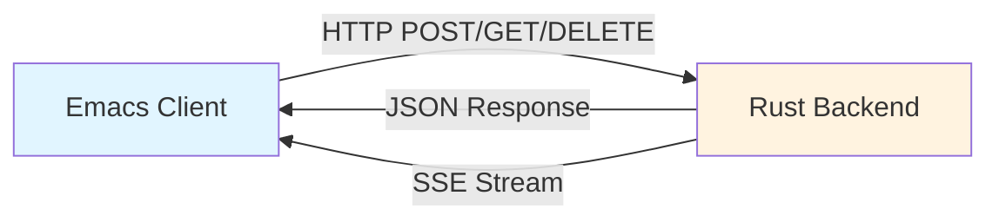
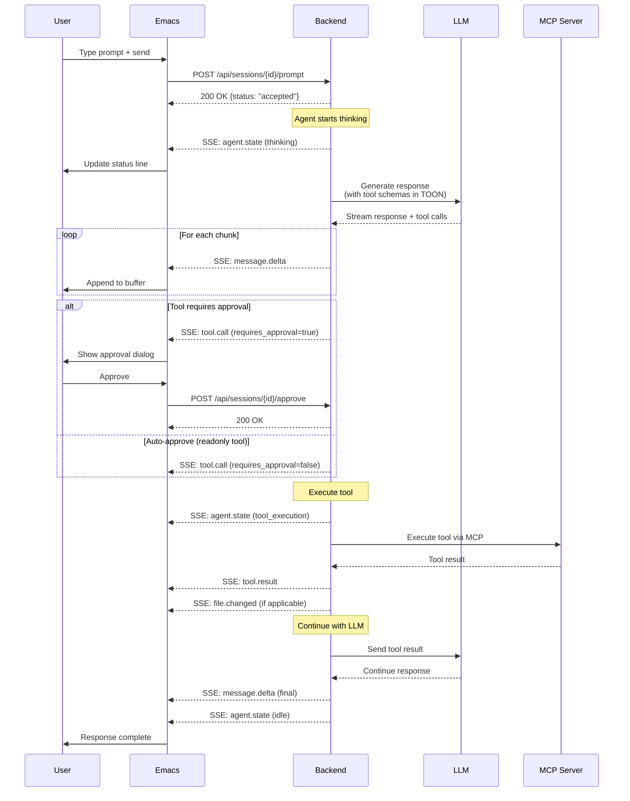
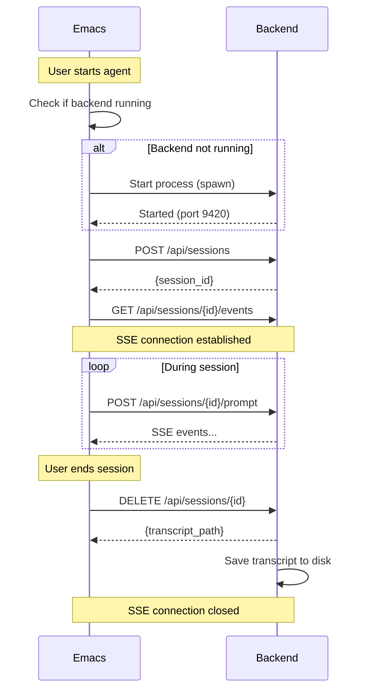
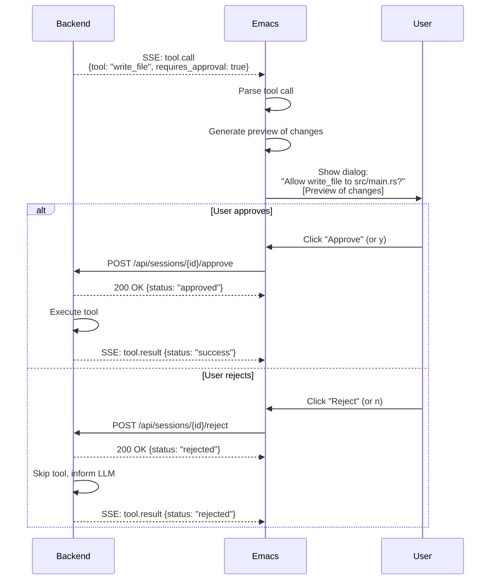
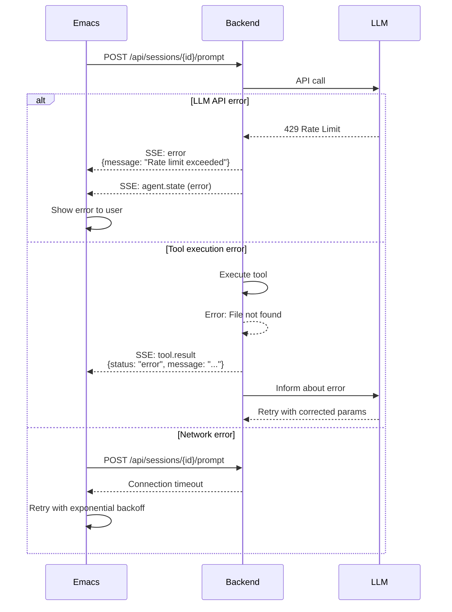

# Communication Protocol

This page documents the HTTP REST API and Server-Sent Events (SSE) protocol used for communication between the Emacs frontend and Rust backend.

## Protocol Overview

Emacs-Agent uses a **hybrid communication model**:

1. **HTTP REST API** - Request/response for commands and control
2. **Server-Sent Events (SSE)** - Unidirectional streaming for real-time updates



## HTTP REST API

### Base URL

```
http://localhost:9420/api
```

### Endpoints

#### Session Management

##### Create Session

```http
POST /api/sessions
Content-Type: application/json

{
  "project_path": "/path/to/project",
  "model": "claude-sonnet-4.5",
  "config": {
    "auto_approve_readonly": true,
    "save_transcript": true
  }
}
```

**Response:**
```json
{
  "session_id": "550e8400-e29b-41d4-a716-446655440000",
  "status": "active",
  "created_at": "2025-11-14T10:30:00Z"
}
```

##### Get Session Info

```http
GET /api/sessions/{session_id}
```

**Response:**
```json
{
  "session_id": "550e8400-e29b-41d4-a716-446655440000",
  "status": "active",
  "project_path": "/path/to/project",
  "model": "claude-sonnet-4.5",
  "message_count": 15,
  "started_at": "2025-11-14T10:30:00Z"
}
```

##### End Session

```http
DELETE /api/sessions/{session_id}
```

**Response:**
```json
{
  "status": "closed",
  "transcript_path": "/home/user/.emacs-agent/transcripts/project/2025-11-14/session-uuid.org"
}
```

#### Agent Interaction

##### Send Prompt

```http
POST /api/sessions/{session_id}/prompt
Content-Type: application/json

{
  "text": "Implement user authentication",
  "context": {
    "current_file": "src/main.rs",
    "cursor_position": {"line": 45, "column": 12},
    "visible_region": {"start": 1, "end": 100}
  }
}
```

**Response:**
```json
{
  "status": "accepted",
  "agent_state": "thinking"
}
```

##### Interrupt Agent

```http
POST /api/sessions/{session_id}/interrupt
```

**Response:**
```json
{
  "status": "interrupted",
  "agent_state": "idle"
}
```

#### Tool Approval

##### Approve Tool Call

```http
POST /api/sessions/{session_id}/approve
Content-Type: application/json

{
  "tool_call_id": "tc_abc123"
}
```

**Response:**
```json
{
  "status": "approved",
  "tool_call_id": "tc_abc123"
}
```

##### Reject Tool Call

```http
POST /api/sessions/{session_id}/reject
Content-Type: application/json

{
  "tool_call_id": "tc_abc123",
  "reason": "Incorrect file path"
}
```

**Response:**
```json
{
  "status": "rejected",
  "tool_call_id": "tc_abc123"
}
```

#### Transcripts

##### Get Transcript

```http
GET /api/sessions/{session_id}/transcript?format=org
```

**Query Parameters:**
- `format`: `json` | `markdown` | `org` (default: `json`)

**Response:** Transcript in requested format

##### List All Transcripts

```http
GET /api/transcripts?project=/path/to/project
```

**Response:**
```json
{
  "transcripts": [
    {
      "session_id": "550e8400-e29b-41d4-a716-446655440000",
      "project_path": "/path/to/project",
      "started_at": "2025-11-14T10:30:00Z",
      "message_count": 23,
      "files_changed": ["src/auth.rs", "src/main.rs"]
    }
  ]
}
```

##### Resume Session

```http
POST /api/sessions/{session_id}/resume
```

**Response:**
```json
{
  "status": "resumed",
  "session_id": "550e8400-e29b-41d4-a716-446655440000",
  "message_count": 23
}
```

## Server-Sent Events (SSE)

### Event Stream Endpoint

```http
GET /api/sessions/{session_id}/events
Accept: text/event-stream
```

This endpoint returns a continuous stream of Server-Sent Events for real-time updates.

### Event Types

#### 1. Message Delta (Streaming Response)

Sent as the LLM generates response text.

```
event: message.delta
data: {
data:   "type": "message.delta",
data:   "content": "I'll implement user authentication using...",
data:   "role": "assistant"
data: }
```

#### 2. Tool Call

Sent when the agent wants to execute a tool.

```
event: tool.call
data: {
data:   "type": "tool.call",
data:   "tool_call_id": "tc_abc123",
data:   "tool": "read_file",
data:   "params": {
data:     "path": "src/auth.rs"
data:   },
data:   "requires_approval": false
data: }
```

#### 3. Tool Result

Sent after tool execution completes.

```
event: tool.result
data: {
data:   "type": "tool.result",
data:   "tool_call_id": "tc_abc123",
data:   "status": "success",
data:   "result": "... file contents ..."
data: }
```

#### 4. File Changed

Sent when a file is modified by a tool.

```
event: file.changed
data: {
data:   "type": "file.changed",
data:   "path": "src/auth.rs",
data:   "operation": "write",
data:   "timestamp": "2025-11-14T10:35:00Z"
data: }
```

#### 5. Agent State

Sent when the agent's state changes.

```
event: agent.state
data: {
data:   "type": "agent.state",
data:   "state": "thinking",
data:   "details": "Analyzing code structure..."
data: }
```

**Possible states:**
- `idle` - Waiting for user input
- `thinking` - LLM generating response
- `tool_execution` - Executing a tool
- `waiting_approval` - Waiting for user to approve tool
- `error` - Error occurred

#### 6. Error

Sent when an error occurs.

```
event: error
data: {
data:   "type": "error",
data:   "message": "Failed to read file: Permission denied",
data:   "code": "PERMISSION_DENIED"
data: }
```

## Sequence Diagrams

### Complete Prompt-to-Response Flow



### Session Lifecycle



### Tool Approval Flow



### Error Handling Flow



## Data Formats

### JSON Request/Response

All HTTP requests and responses use `application/json` content type with standard JSON encoding.

**Example Request:**
```json
{
  "text": "Implement authentication",
  "context": {
    "current_file": "src/main.rs",
    "cursor_position": {"line": 45, "column": 12}
  }
}
```

**Example Response:**
```json
{
  "status": "accepted",
  "agent_state": "thinking",
  "timestamp": "2025-11-14T10:30:00Z"
}
```

### TOON Format (Optional)

For MCP tool definitions, the backend may use **TOON** (Token-Oriented Object Notation) to reduce token usage by 30-60%.

**JSON (traditional):**
```json
{
  "tools": [
    {
      "name": "read_file",
      "description": "Read file contents",
      "parameters": {
        "path": {"type": "string", "required": true}
      }
    }
  ]
}
```

**TOON (optimized):**
```toon
tools: 3
  name          description              params
  read_file     Read file contents       path:string!
  write_file    Write to file            path:string! content:string!
  edit_file     Edit existing file       path:string! old:string! new:string!
```

See: [MCP Integration](MCP-Integration) for TOON details

## Error Codes

### HTTP Status Codes

| Code | Meaning | Description |
|------|---------|-------------|
| 200 | OK | Request successful |
| 201 | Created | Session created |
| 400 | Bad Request | Invalid request format |
| 404 | Not Found | Session not found |
| 409 | Conflict | Session already exists |
| 429 | Too Many Requests | Rate limit exceeded |
| 500 | Internal Server Error | Backend error |
| 503 | Service Unavailable | Backend not ready |

### Application Error Codes

Returned in error responses:

```json
{
  "error": {
    "code": "SESSION_NOT_FOUND",
    "message": "Session 123 does not exist",
    "details": {}
  }
}
```

| Code | Description |
|------|-------------|
| `SESSION_NOT_FOUND` | Session ID doesn't exist |
| `INVALID_TOOL_CALL` | Tool call ID not found |
| `PERMISSION_DENIED` | File operation not allowed |
| `LLM_API_ERROR` | Error calling LLM API |
| `MCP_SERVER_ERROR` | MCP server failed |
| `TRANSCRIPT_ERROR` | Failed to save/load transcript |

## Implementation Notes

### SSE Connection Management

**Emacs side:**
```elisp
(defun emacs-agent-api-subscribe (session-id callback)
  "Subscribe to SSE events for SESSION-ID."
  (let* ((url (format "%s/api/sessions/%s/events"
                     emacs-agent-backend-url
                     session-id))
         (url-request-method "GET")
         (url-request-extra-headers
          '(("Accept" . "text/event-stream"))))
    (url-retrieve url
                  (lambda (status)
                    (emacs-agent-api--handle-sse-stream callback)))))

(defun emacs-agent-api--handle-sse-stream (callback)
  "Parse SSE stream and call CALLBACK for each event."
  (goto-char (point-min))
  (search-forward "\n\n") ; Skip headers
  (while (not (eobp))
    (when (looking-at "event: \\(.*\\)\ndata: \\(.*\\)")
      (let* ((event-type (match-string 1))
             (event-data (json-parse-string (match-string 2))))
        (funcall callback event-type event-data)))))
```

**Rust side:**
```rust
use axum::response::sse::{Event, KeepAlive, Sse};
use tokio_stream::StreamExt;

async fn session_events(
    Path(session_id): Path<Uuid>,
) -> Sse<impl Stream<Item = Result<Event, Infallible>>> {
    let stream = get_session_event_stream(session_id)
        .map(|event| {
            Event::default()
                .event(event.event_type)
                .json_data(event.data)
        });

    Sse::new(stream).keep_alive(KeepAlive::default())
}
```

### Retry and Backoff

**Emacs implements exponential backoff for network errors:**

```elisp
(defun emacs-agent-api-request-with-retry (method endpoint data callback)
  "Request with exponential backoff retry (max 4 attempts)."
  (let ((attempts 0)
        (delays '(2 4 8 16))) ; seconds
    (while (and (< attempts 4) (not success))
      (condition-case err
          (progn
            (emacs-agent-api-request method endpoint data callback)
            (setq success t))
        (error
         (let ((delay (nth attempts delays)))
           (message "Request failed, retrying in %ds..." delay)
           (sleep-for delay)
           (setq attempts (1+ attempts))))))))
```

## Security Considerations

### Authentication

**Single-user local deployment:** No authentication required (localhost only)

**Multi-user deployment:** Token-based authentication:

```http
POST /api/sessions
Authorization: Bearer <token>
```

### Tool Execution Safety

**Read-only tools** (auto-approved):
- `read_file`
- `search_files`
- `git_status`
- `lsp_diagnostics`

**Write tools** (require approval):
- `write_file`
- `edit_file`
- `delete_file`
- `git_commit`
- `shell_exec`

### MCP Server Isolation

MCP servers run in **separate processes** with:
- Resource limits (CPU, memory)
- stdio-only communication
- No network access (unless explicitly allowed)

See: [Tool System](Tool-System) for security details

## Related Pages

- [Architecture Overview](Architecture-Overview) - System architecture
- [Rust Backend](Rust-Backend) - Backend implementation
- [Emacs Frontend](Emacs-Frontend) - Frontend implementation
- [MCP Integration](MCP-Integration) - Tool protocol
- [Tool System](Tool-System) - Tool execution and approval

## External Resources

- [Server-Sent Events Specification](https://html.spec.whatwg.org/multipage/server-sent-events.html)
- [axum SSE Documentation](https://docs.rs/axum/latest/axum/response/sse/)
- [Model Context Protocol](https://modelcontextprotocol.io/)
