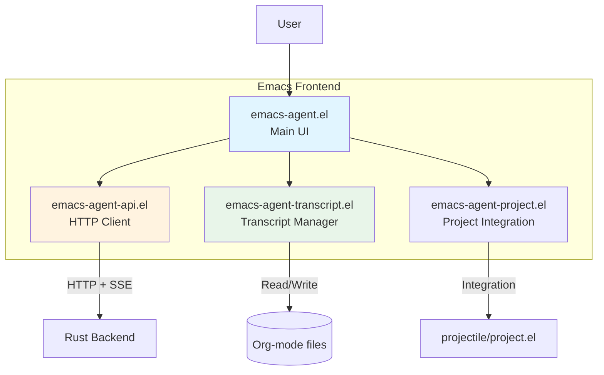

# Emacs Frontend

This page documents the Emacs Lisp frontend implementation, including UI components, API client, and integration with the Emacs ecosystem.

## Overview

The **Emacs frontend** provides a native, buffer-based user interface for interacting with the Rust backend agent.



## Package Structure

### File Organization

```
emacs-agent/
├── emacs-agent.el              # Main entry point
├── emacs-agent-api.el          # HTTP/SSE client
├── emacs-agent-ui.el           # Buffer UI components
├── emacs-agent-transcript.el   # Transcript management
├── emacs-agent-project.el      # Project integration
└── emacs-agent-utils.el        # Utilities
```

### Dependencies

```elisp
;; Built-in (no external dependencies required)
(require 'url)          ; HTTP client
(require 'json)         ; JSON parsing
(require 'org)          ; Org-mode integration

;; Optional integrations
(require 'projectile)   ; Project management (optional)
(require 'magit)        ; Git integration (optional)
(require 'markdown-mode) ; Markdown support (optional)
```

## Core Package (emacs-agent.el)

### Main Entry Point

```elisp
;;; emacs-agent.el --- AI coding agent for Emacs

(defgroup emacs-agent nil
  "AI coding agent for Emacs."
  :group 'tools
  :prefix "emacs-agent-")

(defcustom emacs-agent-backend-url "http://localhost:9420"
  "URL of the Rust agent backend server."
  :type 'string
  :group 'emacs-agent)

(defcustom emacs-agent-backend-binary "emacs-agent-backend"
  "Path to Rust backend binary."
  :type 'string
  :group 'emacs-agent)

(defcustom emacs-agent-model "claude-sonnet-4.5"
  "LLM model to use."
  :type 'string
  :group 'emacs-agent)

(defcustom emacs-agent-auto-approve-readonly t
  "Auto-approve read-only tool calls."
  :type 'boolean
  :group 'emacs-agent)

;; State
(defvar emacs-agent--current-session nil
  "Current agent session ID.")

(defvar emacs-agent--backend-process nil
  "Rust backend process.")
```

### Main Commands

```elisp
;;;###autoload
(defun emacs-agent-start ()
  "Start agent session."
  (interactive)
  (emacs-agent--ensure-backend-running)

  (let* ((project-path (emacs-agent--get-project-path))
         (session-id (emacs-agent-api-create-session project-path)))

    (setq emacs-agent--current-session session-id)

    ;; Show agent buffer
    (emacs-agent-ui-show-buffer session-id)

    ;; Subscribe to events
    (emacs-agent-api-subscribe session-id
                               #'emacs-agent--handle-event)

    (message "Agent started (session: %s)" session-id)))

;;;###autoload
(defun emacs-agent-send-message (text)
  "Send TEXT to the agent."
  (interactive "sPrompt: ")
  (unless emacs-agent--current-session
    (error "No active session. Run M-x emacs-agent-start"))

  (emacs-agent-api-send-prompt emacs-agent--current-session text)
  (message "Sent prompt to agent"))

;;;###autoload
(defun emacs-agent-stop ()
  "Stop current agent session."
  (interactive)
  (when emacs-agent--current-session
    (emacs-agent-api-end-session emacs-agent--current-session)
    (setq emacs-agent--current-session nil)
    (message "Agent stopped")))
```

### Backend Management

```elisp
(defun emacs-agent--ensure-backend-running ()
  "Start Rust backend if not already running."
  (unless (emacs-agent-api-health-check)
    (message "Starting Rust backend...")
    (setq emacs-agent--backend-process
          (start-process "emacs-agent-backend"
                         "*emacs-agent-backend*"
                         emacs-agent-backend-binary
                         "--port" "9420"
                         "--log-level" "info"))

    ;; Wait for backend to be ready
    (let ((attempts 0))
      (while (and (< attempts 20)
                  (not (emacs-agent-api-health-check)))
        (sleep-for 0.5)
        (setq attempts (1+ attempts))))

    (if (emacs-agent-api-health-check)
        (message "Backend started successfully")
      (error "Failed to start backend"))))

(defun emacs-agent--get-project-path ()
  "Get current project path."
  (or (when (fboundp 'projectile-project-root)
        (projectile-project-root))
      (when (fboundp 'project-root)
        (project-root (project-current)))
      default-directory))
```

## HTTP/SSE Client (emacs-agent-api.el)

### Session Management

```elisp
(defun emacs-agent-api-create-session (project-path)
  "Create new agent session for PROJECT-PATH."
  (let* ((url-request-method "POST")
         (url-request-extra-headers
          '(("Content-Type" . "application/json")))
         (url-request-data
          (json-encode `((project_path . ,project-path)
                        (model . ,emacs-agent-model)
                        (config . ((auto_approve_readonly . t)
                                   (save_transcript . t))))))
         (response (emacs-agent-api--request "/api/sessions")))

    (alist-get 'session_id response)))

(defun emacs-agent-api-send-prompt (session-id text)
  "Send TEXT prompt to SESSION-ID."
  (let* ((url-request-method "POST")
         (url-request-extra-headers
          '(("Content-Type" . "application/json")))
         (url-request-data
          (json-encode `((text . ,text)
                        (context . ((current_file . ,(buffer-file-name))
                                    (cursor_position . ((line . ,(line-number-at-pos))
                                                       (column . ,(current-column)))))))))
         (endpoint (format "/api/sessions/%s/prompt" session-id)))

    (emacs-agent-api--request endpoint)))

(defun emacs-agent-api-end-session (session-id)
  "End SESSION-ID."
  (let ((url-request-method "DELETE")
        (endpoint (format "/api/sessions/%s" session-id)))
    (emacs-agent-api--request endpoint)))
```

### HTTP Helper

```elisp
(defun emacs-agent-api--request (endpoint &optional callback)
  "Make HTTP request to ENDPOINT, call CALLBACK with result."
  (let ((url (concat emacs-agent-backend-url endpoint)))
    (url-retrieve url
                  (lambda (status)
                    (goto-char (point-min))
                    (re-search-forward "\n\n")
                    (let* ((json-object-type 'alist)
                           (json-array-type 'list)
                           (response (json-read)))
                      (when callback
                        (funcall callback response))
                      response))
                  nil
                  t)))

(defun emacs-agent-api-health-check ()
  "Check if backend is running."
  (condition-case nil
      (let ((url-request-method "GET"))
        (url-retrieve-synchronously
         (concat emacs-agent-backend-url "/health")
         t nil 1) ; 1 second timeout
        t)
    (error nil)))
```

### SSE Event Handling

```elisp
(defun emacs-agent-api-subscribe (session-id callback)
  "Subscribe to SSE events for SESSION-ID, call CALLBACK for each event."
  (let* ((url (format "%s/api/sessions/%s/events"
                     emacs-agent-backend-url
                     session-id))
         (url-request-method "GET")
         (url-request-extra-headers
          '(("Accept" . "text/event-stream"))))

    (url-retrieve url
                  (lambda (status)
                    (emacs-agent-api--handle-sse-stream callback))
                  nil
                  t)))

(defun emacs-agent-api--handle-sse-stream (callback)
  "Parse SSE stream and call CALLBACK for each event."
  (goto-char (point-min))
  (search-forward "\n\n") ; Skip headers

  (let ((event-type nil)
        (event-data ""))

    (while (not (eobp))
      (let ((line (buffer-substring-no-properties
                   (point) (line-end-position))))

        (cond
         ;; Event type
         ((string-match "^event: \\(.*\\)" line)
          (setq event-type (match-string 1 line)))

         ;; Data line
         ((string-match "^data: \\(.*\\)" line)
          (setq event-data (concat event-data (match-string 1 line))))

         ;; Empty line = event complete
         ((string-empty-p line)
          (when event-type
            (let* ((json-object-type 'alist)
                   (data (json-read-from-string event-data)))
              (funcall callback event-type data))
            (setq event-type nil
                  event-data ""))))

        (forward-line 1)))))
```

## UI Components (emacs-agent-ui.el)

### Agent Buffer

```elisp
(defvar-local emacs-agent-ui--session-id nil
  "Session ID for this buffer.")

(define-derived-mode emacs-agent-mode org-mode "Agent"
  "Major mode for interacting with Emacs-Agent."
  (setq-local header-line-format
              '(:eval (emacs-agent-ui--header-line))))

(defun emacs-agent-ui-show-buffer (session-id)
  "Show agent buffer for SESSION-ID."
  (let ((buffer (get-buffer-create (format "*emacs-agent-%s*" session-id))))
    (with-current-buffer buffer
      (emacs-agent-mode)
      (setq emacs-agent-ui--session-id session-id)
      (emacs-agent-ui--initialize-buffer))

    (pop-to-buffer buffer)))

(defun emacs-agent-ui--initialize-buffer ()
  "Initialize agent buffer."
  (erase-buffer)
  (insert "#+TITLE: Emacs-Agent Session\n")
  (insert "#+DATE: " (format-time-string "%Y-%m-%d %H:%M:%S") "\n\n")
  (insert "* Conversation\n\n")
  (goto-char (point-max)))

(defun emacs-agent-ui--header-line ()
  "Generate header line."
  (format " Session: %s | Model: %s | Status: %s"
          (substring emacs-agent-ui--session-id 0 8)
          emacs-agent-model
          (or emacs-agent-ui--agent-state "idle")))
```

### Event Handlers

```elisp
(defvar-local emacs-agent-ui--agent-state "idle"
  "Current agent state.")

(defun emacs-agent--handle-event (event-type data)
  "Handle SSE event of EVENT-TYPE with DATA."
  (pcase event-type
    ("message.delta"
     (emacs-agent-ui--append-text (alist-get 'content data)))

    ("agent.state"
     (emacs-agent-ui--update-state (alist-get 'state data)))

    ("tool.call"
     (emacs-agent-ui--handle-tool-call data))

    ("tool.result"
     (emacs-agent-ui--show-tool-result data))

    ("file.changed"
     (emacs-agent-ui--handle-file-changed data))

    ("error"
     (emacs-agent-ui--show-error data))))

(defun emacs-agent-ui--append-text (text)
  "Append TEXT to agent buffer."
  (with-current-buffer (format "*emacs-agent-%s*" emacs-agent--current-session)
    (save-excursion
      (goto-char (point-max))
      (insert text)
      (redisplay))))

(defun emacs-agent-ui--update-state (state)
  "Update agent state to STATE."
  (with-current-buffer (format "*emacs-agent-%s*" emacs-agent--current-session)
    (setq emacs-agent-ui--agent-state state)
    (force-mode-line-update)))
```

### Tool Approval UI

```elisp
(defun emacs-agent-ui--handle-tool-call (data)
  "Handle tool call DATA."
  (let ((requires-approval (alist-get 'requires_approval data)))
    (if (and requires-approval
             (not emacs-agent-auto-approve-readonly))
        (emacs-agent-ui--show-approval-dialog data)
      ;; Auto-approved
      (emacs-agent-ui--log-tool-call data "auto-approved"))))

(defun emacs-agent-ui--show-approval-dialog (tool-call)
  "Show approval dialog for TOOL-CALL."
  (let* ((tool (alist-get 'tool tool-call))
         (params (alist-get 'params tool-call))
         (preview (emacs-agent-ui--generate-preview tool params))
         (buffer (get-buffer-create "*Agent Approval*")))

    (with-current-buffer buffer
      (erase-buffer)
      (insert (format "# Tool Approval Request\n\n"))
      (insert (format "**Tool:** %s\n" tool))
      (insert (format "**Parameters:**\n```json\n%s\n```\n\n"
                     (json-encode params)))
      (when preview
        (insert "## Preview\n\n")
        (insert preview)
        (insert "\n\n"))
      (insert "## Actions\n\n")
      (insert "- `y` - Approve\n")
      (insert "- `n` - Reject\n")
      (insert "- `a` - Always approve this tool\n")

      (markdown-mode)
      (goto-char (point-min))
      (pop-to-buffer (current-buffer)))

    ;; Wait for user decision
    (let ((decision (read-char-choice
                     "Approve tool? (y/n/a) "
                     '(?y ?n ?a))))
      (pcase decision
        (?y (emacs-agent-api-approve-tool
             emacs-agent--current-session
             (alist-get 'tool_call_id tool-call)))
        (?n (emacs-agent-api-reject-tool
             emacs-agent--current-session
             (alist-get 'tool_call_id tool-call)))
        (?a (progn
              (customize-save-variable 'emacs-agent-auto-approve-tools
                                       (cons tool emacs-agent-auto-approve-tools))
              (emacs-agent-api-approve-tool
               emacs-agent--current-session
               (alist-get 'tool_call_id tool-call)))))

      (kill-buffer buffer))))
```

## Project Integration (emacs-agent-project.el)

### Projectile Integration

```elisp
(defun emacs-agent-for-project ()
  "Start agent for current project."
  (interactive)
  (let ((project-path (projectile-project-root)))
    (unless project-path
      (error "Not in a project"))

    (emacs-agent-start)
    (message "Agent started for project: %s" project-path)))

(defun emacs-agent-project-context ()
  "Send current project context to agent."
  (interactive)
  (let* ((files (projectile-current-project-files))
         (context (emacs-agent--build-project-context files)))
    (emacs-agent-api-send-context emacs-agent--current-session context)))
```

### Magit Integration

```elisp
(defun emacs-agent-commit-changes ()
  "Ask agent to commit current changes."
  (interactive)
  (let ((diff (magit-diff-buffer-files)))
    (emacs-agent-send-message
     (format "Review and commit these changes:\n%s" diff))))
```

## Keybindings

```elisp
(defvar emacs-agent-mode-map
  (let ((map (make-sparse-keymap)))
    (define-key map (kbd "C-c C-c") #'emacs-agent-send-message)
    (define-key map (kbd "C-c C-k") #'emacs-agent-stop)
    (define-key map (kbd "C-c C-r") #'emacs-agent-resume-session)
    map)
  "Keymap for emacs-agent-mode.")

(defun emacs-agent-setup-keybindings ()
  "Setup global keybindings."
  (global-set-key (kbd "C-c a s") #'emacs-agent-start)
  (global-set-key (kbd "C-c a m") #'emacs-agent-send-message)
  (global-set-key (kbd "C-c a k") #'emacs-agent-stop))
```

## Installation

### Manual Installation

```elisp
;; Add to load-path
(add-to-list 'load-path "/path/to/emacs-agent")

;; Load package
(require 'emacs-agent)

;; Configure
(setq emacs-agent-backend-binary "/usr/local/bin/emacs-agent-backend")
(setq emacs-agent-model "claude-sonnet-4.5")

;; Setup keybindings
(emacs-agent-setup-keybindings)
```

### use-package

```elisp
(use-package emacs-agent
  :load-path "/path/to/emacs-agent"
  :config
  (setq emacs-agent-backend-binary "emacs-agent-backend")
  (setq emacs-agent-model "claude-sonnet-4.5")
  (setq emacs-agent-auto-approve-readonly t)
  (emacs-agent-setup-keybindings))
```

## Related Pages

- [Architecture Overview](Architecture-Overview) - System design
- [Communication Protocol](Communication-Protocol) - HTTP/SSE API
- [Transcript Management](Transcript-Management) - Session persistence
- [Rust Backend](Rust-Backend) - Backend implementation

## External Resources

- [Emacs Lisp Reference Manual](https://www.gnu.org/software/emacs/manual/html_node/elisp/)
- [url.el Documentation](https://www.gnu.org/software/emacs/manual/html_node/url/)
- [Org-mode Manual](https://orgmode.org/manual/)
