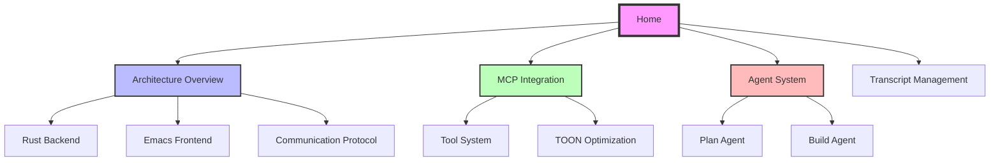

# Emacs-Agent Wiki

Welcome to the **Emacs-Agent** documentation wiki! This project combines powerful Rust-based agent capabilities with Emacs' native workflow.

## What is Emacs-Agent?

Emacs-Agent is an AI coding assistant that brings agentic capabilities directly into your Emacs workflow. It features:

- **Rust Backend** for extreme performance (10-100x faster than Node.js alternatives)
- **TOON Format** for 60% token reduction in MCP tool definitions
- **MCP Latest Spec** optimizations for efficient tool loading
- **Persistent Org-Mode Transcripts** solving Claude Code's context loss problem
- **Native Emacs Integration** with buffer-based UI and project integration

## Architecture Documentation

### Core Architecture
- **[Architecture Overview](Architecture-Overview)** - High-level system architecture with block diagrams
- **[Rust Backend](Rust-Backend)** - Detailed backend architecture and components
- **[Emacs Frontend](Emacs-Frontend)** - Emacs integration and UI components
- **[Communication Protocol](Communication-Protocol)** - HTTP/SSE protocol with sequence diagrams

### Key Components
- **[MCP Integration](MCP-Integration)** - Model Context Protocol with TOON optimization
- **[Tool System](Tool-System)** - Tool architecture and execution flows
- **[Agent System](Agent-System)** - Multi-agent orchestration (Plan, Build, Custom)
- **[Transcript Management](Transcript-Management)** - Persistent session storage

## Quick Navigation



## Key Features

### ✓ Persistent Transcripts
All conversations saved to `~/.emacs-agent/transcripts/` in multiple formats:
- **JSON** - Canonical format for tools
- **Markdown** - Human-readable format
- **Org-mode** - Native Emacs format for easy browsing

### ✓ Extreme Token Efficiency
- **TOON format**: 30-60% token reduction for MCP tool definitions
- **Hierarchical tool loading**: Load only relevant tools
- **Lazy loading**: On-demand tool schema fetching
- **Result**: 60-70% overall token savings

### ✓ Agentic Operations
- File operations (read, write, edit, search)
- Git workflows (commit, branch, PR)
- Shell command execution (with approval)
- MCP server integration (extensible tools)

### ✓ Multi-Agent System
- **Plan Agent**: Analysis and planning (read-only)
- **Build Agent**: Code modification
- **Custom Agents**: Extensible via Rust

### ✓ Native Emacs Integration
- Buffer-based UI (no terminal emulator needed)
- Project/projectile integration
- Magit integration for git operations
- Org-mode for transcripts

## Technology Stack

### Rust Backend
- **Language**: Rust 1.75+
- **HTTP Server**: axum or actix-web
- **Async Runtime**: tokio
- **Serialization**: serde_json, toon-rs
- **MCP Client**: Custom with TOON support
- **LLM Clients**: async-openai, anthropic-sdk-rust

### Emacs Frontend
- **Language**: Emacs Lisp
- **Dependencies**: `url`, `json`, `org` (all built-in)
- **Optional**: `projectile`, `magit`

## Performance Highlights

### Token Optimization
**Baseline** (50 tools, JSON):
- Tool definitions: 20,000 tokens
- Conversation: 10,000 tokens
- **Total**: 30,000 tokens (93% of 32K window)

**With TOON + MCP optimizations**:
- Tool categories: 60 tokens
- Relevant tools (8): 1,920 tokens
- Conversation: 10,000 tokens
- **Total**: 11,980 tokens (37% of 32K window)

**Savings**: 18,020 tokens = **60% reduction** ✨

### Runtime Performance
- HTTP latency: 0.2ms vs 5ms (25x faster than Node.js)
- SSE dispatch: 0.1ms vs 2ms (20x faster)
- TOON encoding: 0.5ms vs 15ms (30x faster)
- Memory usage: 10MB vs 150MB (15x less)

## Project Status

**Current Phase**: Architecture & Planning

See the main repository [ROADMAP.md](https://github.com/softwarewrighter/emacs-agent/blob/main/ROADMAP.md) for implementation plan.

## Getting Started

Once released, installation will be simple:

```elisp
;; Install emacs-agent
(use-package emacs-agent
  :ensure t
  :config
  (setq emacs-agent-backend-binary "emacs-agent-backend")
  (setq emacs-agent-model "claude-sonnet-4.5")
  (emacs-agent-mode 1))

;; Start agent session (auto-starts Rust backend)
M-x emacs-agent-start

;; Send prompt
M-x emacs-agent-send-message RET "Implement user authentication" RET
```

## Contributing

This project is in early planning stages. Contributions welcome once basic implementation is complete!

## External Links

- [Main Repository](https://github.com/softwarewrighter/emacs-agent)
- [Rust Backend Fork](https://github.com/softwarewrighter/open_agent_cli_fork)
- [TOON Format Specification](https://github.com/toon-format/toon)
- [Model Context Protocol](https://modelcontextprotocol.io/)
