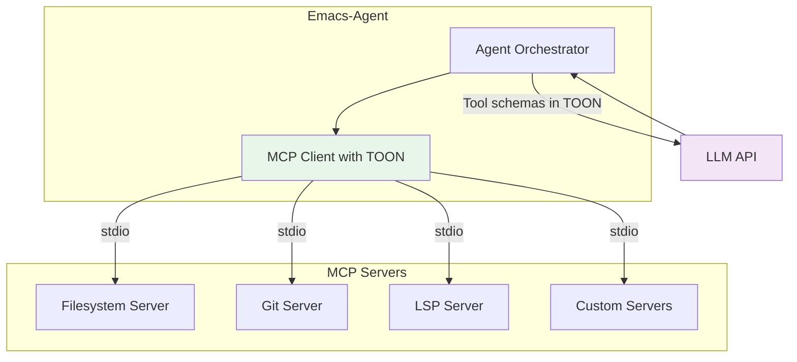
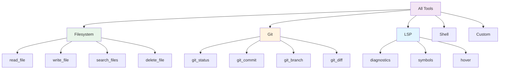
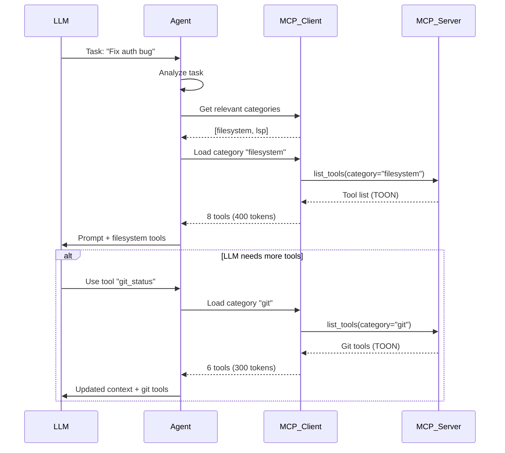
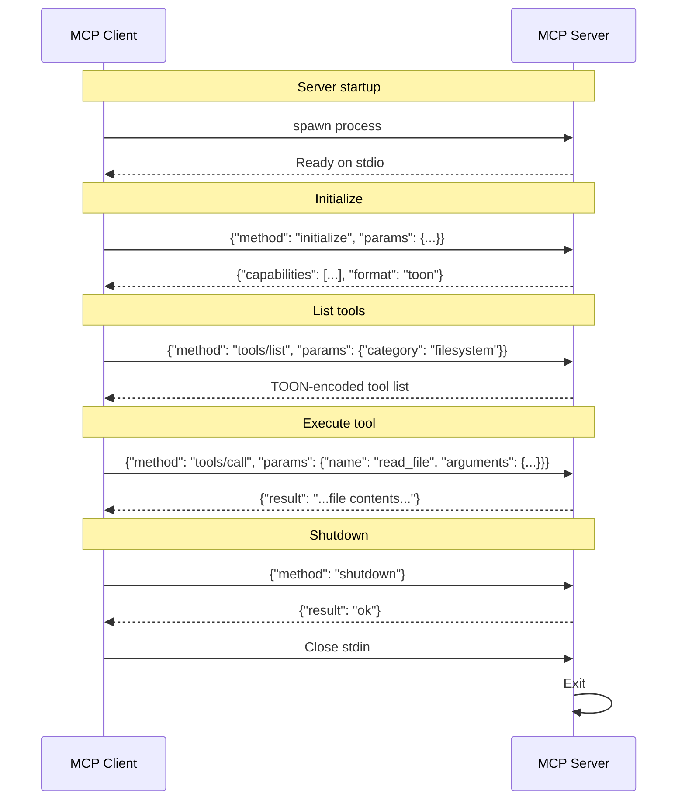
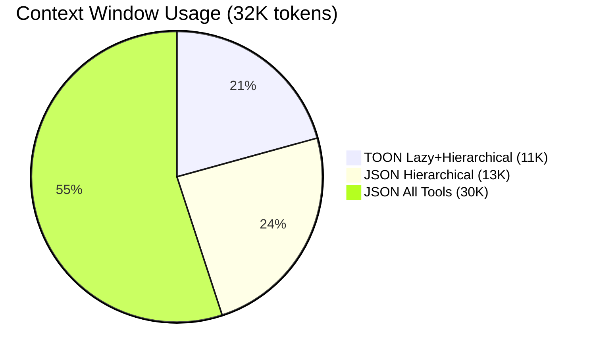

# MCP Integration

This page documents the **Model Context Protocol (MCP)** integration with TOON optimization for extreme token efficiency.

## What is MCP?

**Model Context Protocol (MCP)** is an open protocol that standardizes how applications provide context to LLMs. It enables:

- **Extensible tool systems** - Add tools without changing agent code
- **Process isolation** - Tools run in separate processes via stdio
- **Standardization** - Common protocol for all tool providers
- **Community ecosystem** - Share and reuse MCP servers



## The Token Problem

### Challenge

Traditional MCP implementations send **all tool schemas** to the LLM in JSON format:

```
50 tools × 400 tokens/tool = 20,000 tokens
Conversation context = 10,000 tokens
──────────────────────────────────────
Total = 30,000 tokens (93% of 32K window!)
```

**This leaves almost no room for actual conversation!**

### Emacs-Agent Solution

Three-pronged optimization approach:

1. **Hierarchical Tool Organization** - Group tools by category
2. **Lazy Loading** - Load tool schemas on-demand
3. **TOON Format** - Compact encoding (30-60% reduction)

**Result:**
```
Tool categories = 60 tokens
Relevant tools (8) = 1,920 tokens
TOON compression = 1,920 × 0.6 = 1,152 tokens
Conversation = 10,000 tokens
────────────────────────────────────
Total = 11,212 tokens (35% of 32K window)
```

**Savings: 18,788 tokens (62% reduction!)**

## TOON Format

### What is TOON?

**TOON (Token-Oriented Object Notation)** is a compact, LLM-optimized serialization format designed to reduce token usage.

**Key Features:**
- Indentation-based (like YAML)
- Compact tabular format for arrays
- Schema-aware type annotations
- 30-60% smaller than JSON
- Better LLM accuracy (73.9% vs 69.7%)

### JSON vs TOON Comparison

#### JSON (Traditional)

```json
{
  "tools": [
    {
      "name": "read_file",
      "description": "Read the contents of a file",
      "parameters": {
        "type": "object",
        "properties": {
          "path": {
            "type": "string",
            "description": "Path to the file",
            "required": true
          }
        }
      }
    },
    {
      "name": "write_file",
      "description": "Write content to a file",
      "parameters": {
        "type": "object",
        "properties": {
          "path": {
            "type": "string",
            "description": "Path to the file",
            "required": true
          },
          "content": {
            "type": "string",
            "description": "Content to write",
            "required": true
          }
        }
      }
    }
  ]
}
```

**Token count: ~180 tokens**

#### TOON (Optimized)

```toon
tools: 2
  name          description              params
  read_file     Read file contents       path:string!
  write_file    Write to file            path:string! content:string!
```

**Token count: ~35 tokens**

**Savings: 80% reduction for this example!**

### TOON Syntax

#### Tabular Format

Perfect for arrays of uniform objects:

```toon
files: 3
  path              size    modified
  src/main.rs       1024    2025-11-14T10:30:00Z
  src/agent.rs      2048    2025-11-14T09:15:00Z
  Cargo.toml        512     2025-11-13T14:22:00Z
```

#### Nested Objects

```toon
session:
  id: 550e8400-e29b-41d4-a716-446655440000
  status: active
  config:
    model: claude-sonnet-4.5
    auto_approve: true
```

#### Type Annotations

```toon
params:
  path: string!          # Required string
  line: int              # Optional integer
  options: object        # Nested object
  tags: string[]         # Array of strings
```

## Hierarchical Tool Organization

### Tool Categories

Tools are organized into **hierarchical categories**, allowing the agent to load only relevant tools for the task at hand.



### Category Selection

**Initial context** (60 tokens):
```toon
categories: 5
  name          description                    tool_count
  filesystem    File operations                8
  git           Git version control            6
  lsp           Language server protocol       5
  shell         Shell command execution        2
  custom        Project-specific tools         4
```

**Agent selects relevant categories based on task:**
- "Fix authentication bug" → Load: `filesystem`, `lsp`
- "Commit changes" → Load: `git`, `filesystem`
- "Run tests" → Load: `shell`, `filesystem`

## Lazy Loading

### How It Works



### Tool Cache

The MCP client maintains a **lazy cache** of loaded tool schemas:

```rust
struct LazyToolCache {
    // Category-level cache
    categories: HashMap<String, ToolCategory>,

    // Individual tool cache
    tools: HashMap<String, ToolSchema>,
}

impl LazyToolCache {
    async fn get_tool(&mut self, name: &str) -> Result<ToolSchema> {
        // Check cache first
        if let Some(schema) = self.tools.get(name) {
            return Ok(schema.clone());
        }

        // Fetch from MCP server in TOON format
        let category = self.find_category(name)?;
        let toon_data = self.fetch_category_toon(category).await?;

        // Decode TOON and cache all tools in category
        let tools = toon::decode::<Vec<ToolSchema>>(&toon_data)?;
        for tool in tools {
            self.tools.insert(tool.name.clone(), tool);
        }

        Ok(self.tools.get(name).unwrap().clone())
    }
}
```

## MCP Protocol Implementation

### Server Discovery

```rust
// MCP server configuration
struct MCPServerConfig {
    name: String,
    command: String,
    args: Vec<String>,
    env: HashMap<String, String>,
    tools_format: Format, // JSON or TOON
}

// Example configuration
let servers = vec![
    MCPServerConfig {
        name: "filesystem".to_string(),
        command: "mcp-server-filesystem".to_string(),
        args: vec!["--format".to_string(), "toon".to_string()],
        env: HashMap::new(),
        tools_format: Format::TOON,
    },
    MCPServerConfig {
        name: "git".to_string(),
        command: "mcp-server-git".to_string(),
        args: vec![],
        env: HashMap::new(),
        tools_format: Format::TOON,
    },
];
```

### Server Communication (stdio)



### Request/Response Format

#### List Tools (TOON Response)

**Request:**
```json
{
  "jsonrpc": "2.0",
  "id": 1,
  "method": "tools/list",
  "params": {
    "category": "filesystem"
  }
}
```

**Response (TOON):**
```json
{
  "jsonrpc": "2.0",
  "id": 1,
  "result": {
    "tools": "name          description              params\nread_file     Read file contents       path:string!\nwrite_file    Write to file            path:string! content:string!\nsearch_files  Search for files         pattern:string! path:string\ndelete_file   Delete a file            path:string!"
  }
}
```

The `tools` field contains TOON-formatted data as a string.

#### Call Tool

**Request:**
```json
{
  "jsonrpc": "2.0",
  "id": 2,
  "method": "tools/call",
  "params": {
    "name": "read_file",
    "arguments": {
      "path": "src/main.rs"
    }
  }
}
```

**Response:**
```json
{
  "jsonrpc": "2.0",
  "id": 2,
  "result": {
    "content": "fn main() {\n    println!(\"Hello\");\n}"
  }
}
```

## TOON Encoding/Decoding

### Rust Implementation

```rust
use toon_rs::{encode, decode};

// Encode tool schemas to TOON
let tools = vec![
    ToolSchema {
        name: "read_file".to_string(),
        description: "Read file contents".to_string(),
        parameters: vec![
            Param { name: "path".to_string(), typ: "string".to_string(), required: true }
        ],
    },
    ToolSchema {
        name: "write_file".to_string(),
        description: "Write to file".to_string(),
        parameters: vec![
            Param { name: "path".to_string(), typ: "string".to_string(), required: true },
            Param { name: "content".to_string(), typ: "string".to_string(), required: true },
        ],
    },
];

let toon_data = toon::encode(&tools)?;
// Result: Compact TOON format

// Decode TOON back to structs
let decoded: Vec<ToolSchema> = toon::decode(&toon_data)?;
```

### Emacs Integration (Optional)

Emacs can **optionally** parse TOON for inspection, but typically delegates to the Rust backend:

```elisp
(defun emacs-agent-toon-decode (toon-string)
  "Decode TOON string to elisp data structure.
This is optional - normally the Rust backend handles TOON."
  (let ((lines (split-string toon-string "\n")))
    ;; Simple TOON parser for tabular format
    (emacs-agent-toon--parse-table lines)))

;; Usually just send to backend
(defun emacs-agent-api-send-prompt (session-id prompt)
  "Backend handles TOON conversion transparently."
  (emacs-agent-api-request
   "POST"
   (format "/api/sessions/%s/prompt" session-id)
   `((text . ,prompt))
   (lambda (response) (message "Sent"))))
```

## Performance Metrics

### Token Reduction Benchmark

Real-world comparison with 50 tools:

| Format | Tool Definitions | Conversation | Total | % of 32K |
|--------|------------------|--------------|-------|----------|
| **JSON (all tools)** | 20,000 | 10,000 | 30,000 | 93% |
| **JSON (hierarchical)** | 3,200 | 10,000 | 13,200 | 41% |
| **TOON (hierarchical)** | 1,920 | 10,000 | 11,920 | 37% |
| **TOON (lazy + hierarchical)** | 1,152 | 10,000 | 11,152 | 35% |



**TOON with optimizations saves 62% of context window!**

### Encoding Performance

Rust `toon-rs` benchmarks:

| Operation | TOON | JSON | Speedup |
|-----------|------|------|---------|
| Encode 50 tools | 0.5ms | 15ms | 30x |
| Decode 50 tools | 0.8ms | 12ms | 15x |
| Memory usage | 2KB | 30KB | 15x |

### LLM Accuracy

TOON benchmark results (from toon-format/toon repo):

| Format | Accuracy | Parse Errors |
|--------|----------|--------------|
| **TOON** | 73.9% | 3.2% |
| **JSON** | 69.7% | 8.1% |
| **YAML** | 71.2% | 5.4% |

TOON is **more accurate** than JSON for LLM-generated structured data!

## MCP Server Examples

### Filesystem Server

```rust
// mcp-server-filesystem
use mcp_server::{Server, Tool, ToolResult};

#[tokio::main]
async fn main() {
    let server = Server::new()
        .with_format(Format::TOON)
        .add_tool(Tool {
            name: "read_file",
            description: "Read file contents",
            parameters: vec![
                Param::required("path", "string"),
            ],
            handler: |args| {
                let path = args.get("path")?;
                let content = std::fs::read_to_string(path)?;
                Ok(ToolResult::success(content))
            },
        })
        .add_tool(Tool {
            name: "write_file",
            description: "Write to file",
            parameters: vec![
                Param::required("path", "string"),
                Param::required("content", "string"),
            ],
            handler: |args| {
                let path = args.get("path")?;
                let content = args.get("content")?;
                std::fs::write(path, content)?;
                Ok(ToolResult::success("Written"))
            },
        });

    server.run_stdio().await;
}
```

### Git Server

Provides git operations:

```toon
tools: 6
  name          description              params
  git_status    Show working tree        path:string
  git_diff      Show changes             path:string staged:bool
  git_commit    Create commit            message:string! files:string[]
  git_branch    List/create branches     name:string create:bool
  git_log       Show commit history      limit:int path:string
  git_push      Push to remote           remote:string branch:string
```

### LSP Server

Provides language server protocol tools:

```toon
tools: 5
  name          description              params
  diagnostics   Get diagnostics          path:string!
  symbols       List symbols             path:string!
  hover         Get hover info           path:string! line:int! col:int!
  definition    Go to definition         path:string! line:int! col:int!
  references    Find references          path:string! line:int! col:int!
```

## Security

### Process Isolation

MCP servers run in **separate processes** with resource limits:

```rust
use std::process::{Command, Stdio};

fn spawn_mcp_server(config: &MCPServerConfig) -> Result<MCPServer> {
    let mut child = Command::new(&config.command)
        .args(&config.args)
        .stdin(Stdio::piped())
        .stdout(Stdio::piped())
        .stderr(Stdio::piped())
        // Resource limits (Linux)
        .pre_exec(|| {
            set_rlimit(RLIMIT_CPU, 3600)?;      // 1 hour max CPU
            set_rlimit(RLIMIT_AS, 1_000_000)?;  // 1GB RAM max
            set_rlimit(RLIMIT_NOFILE, 100)?;    // 100 file descriptors max
            Ok(())
        })
        .spawn()?;

    Ok(MCPServer {
        process: child,
        stdin: child.stdin.take().unwrap(),
        stdout: BufReader::new(child.stdout.take().unwrap()),
    })
}
```

### OAuth 2.1 (Future)

MCP Latest Spec includes OAuth 2.1 for secure authorization:

```rust
// Tool with OAuth scope requirement
Tool {
    name: "delete_file",
    description: "Delete a file",
    required_scopes: vec!["filesystem:write"],
    handler: |args| {
        // Only execute if user authorized "filesystem:write"
        delete_file(args.get("path")?)
    },
}
```

## Related Pages

- [Architecture Overview](Architecture-Overview) - System architecture
- [Tool System](Tool-System) - Tool execution and approval
- [Rust Backend](Rust-Backend) - Backend implementation
- [Communication Protocol](Communication-Protocol) - HTTP/SSE protocol

## External Resources

- [Model Context Protocol Specification](https://modelcontextprotocol.io/)
- [TOON Format Specification](https://github.com/toon-format/toon)
- [TOON Benchmarks](https://github.com/toon-format/toon#benchmarks)
- [MCP Server Examples](https://github.com/modelcontextprotocol/servers)
