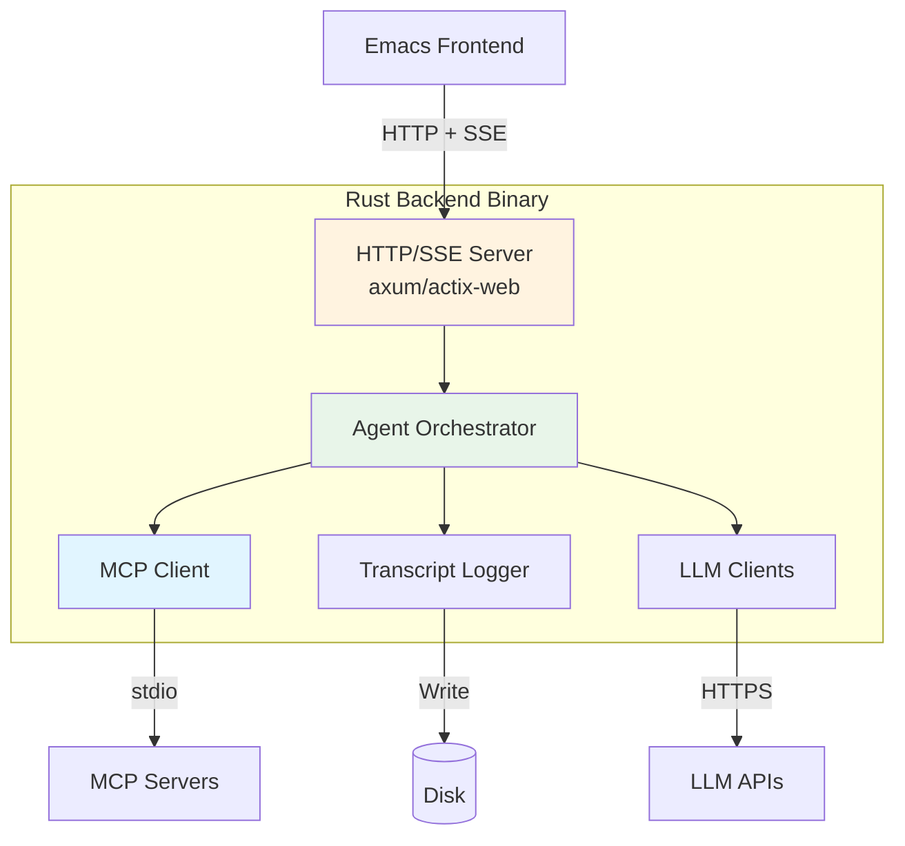
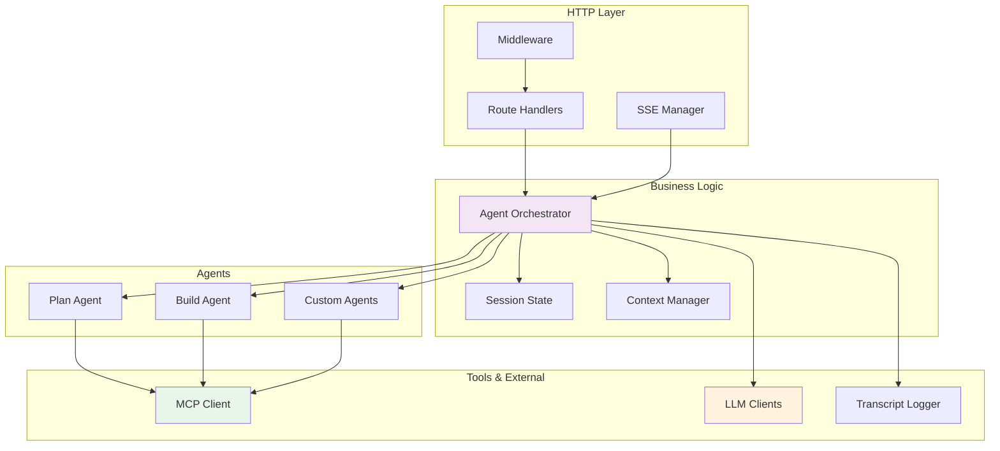

# Rust Backend

This page documents the Rust backend architecture, components, and implementation details.

## Overview

The **Rust backend** is the core engine of Emacs-Agent, handling all agent orchestration, tool execution, and LLM communication.

**Repository:** [open_agent_cli_fork](https://github.com/softwarewrighter/open_agent_cli_fork)



## Why Rust?

### Performance Benefits

| Metric | Rust | Node.js | Speedup |
|--------|------|---------|---------|
| HTTP request latency | 0.2ms | 5ms | 25x |
| SSE event dispatch | 0.1ms | 2ms | 20x |
| TOON encoding | 0.5ms | 15ms | 30x |
| Memory usage | 10MB | 150MB | 15x less |
| Startup time | 50ms | 500ms | 10x |
| Binary size | 5-10MB | N/A | Single binary |

### Key Advantages

1. **Memory Safety** - No null pointers, no data races
2. **Zero-Cost Abstractions** - High-level code without performance penalty
3. **Fearless Concurrency** - Safe parallel execution with tokio
4. **Single Binary** - Easy distribution, no runtime needed
5. **Compile-Time Guarantees** - Catch bugs before deployment

## Architecture

### Component Diagram



## Core Components

### 1. HTTP/SSE Server

**Framework:** axum (fast, ergonomic) or actix-web (battle-tested)

#### Server Setup

```rust
use axum::{
    Router,
    routing::{get, post, delete},
};
use tokio::net::TcpListener;

#[tokio::main]
async fn main() {
    let app = Router::new()
        // Session management
        .route("/api/sessions", post(create_session))
        .route("/api/sessions/:id", get(get_session))
        .route("/api/sessions/:id", delete(end_session))

        // Agent interaction
        .route("/api/sessions/:id/prompt", post(send_prompt))
        .route("/api/sessions/:id/interrupt", post(interrupt_agent))
        .route("/api/sessions/:id/events", get(session_events))

        // Tool approval
        .route("/api/sessions/:id/approve", post(approve_tool))
        .route("/api/sessions/:id/reject", post(reject_tool))

        // Transcripts
        .route("/api/sessions/:id/transcript", get(get_transcript))
        .route("/api/transcripts", get(list_transcripts))

        // Middleware
        .layer(middleware::from_fn(logging_middleware))
        .layer(middleware::from_fn(cors_middleware));

    let listener = TcpListener::bind("127.0.0.1:9420").await.unwrap();
    println!("Server running on http://localhost:9420");

    axum::serve(listener, app).await.unwrap();
}
```

#### SSE Implementation

```rust
use axum::response::sse::{Event, KeepAlive, Sse};
use tokio_stream::{Stream, StreamExt};

async fn session_events(
    Path(session_id): Path<Uuid>,
    State(state): State<AppState>,
) -> Sse<impl Stream<Item = Result<Event, Infallible>>> {
    let receiver = state.sessions
        .get(&session_id)
        .expect("Session not found")
        .event_receiver();

    let stream = BroadcastStream::new(receiver)
        .map(|event| {
            Event::default()
                .event(&event.event_type)
                .json_data(&event.data)
        });

    Sse::new(stream).keep_alive(KeepAlive::default())
}
```

### 2. Agent Orchestrator

The orchestrator manages agent lifecycle and coordinates between components.

#### State Machine

```rust
#[derive(Debug, Clone)]
enum AgentState {
    Idle,
    Thinking {
        model_call_id: String,
    },
    ToolExecution {
        tool_call: ToolCall,
    },
    WaitingApproval {
        tool_call: ToolCall,
        timeout: Instant,
    },
    Error {
        message: String,
        recoverable: bool,
    },
}

struct AgentOrchestrator {
    state: AgentState,
    context: Context,
    event_tx: broadcast::Sender<AgentEvent>,
}

impl AgentOrchestrator {
    async fn execute(&mut self, prompt: String) -> Result<Response> {
        self.transition(AgentState::Thinking {
            model_call_id: Uuid::new_v4().to_string(),
        });

        // Send to LLM
        let response = self.llm_client.generate(&prompt, &self.context).await?;

        // Handle tool calls
        for tool_call in response.tool_calls {
            self.handle_tool_call(tool_call).await?;
        }

        self.transition(AgentState::Idle);
        Ok(response)
    }

    fn transition(&mut self, new_state: AgentState) {
        self.state = new_state.clone();
        self.emit_event(AgentEvent::StateChanged { state: new_state });
    }

    fn emit_event(&self, event: AgentEvent) {
        let _ = self.event_tx.send(event);
    }
}
```

### 3. MCP Client

Connects to MCP servers via stdio protocol with TOON optimization.

#### Client Implementation

```rust
use tokio::process::{Command, ChildStdin, ChildStdout};
use tokio::io::{AsyncBufReadExt, AsyncWriteExt, BufReader};

struct MCPClient {
    servers: HashMap<String, MCPServer>,
    tool_cache: LazyToolCache,
}

struct MCPServer {
    name: String,
    stdin: ChildStdin,
    stdout: BufReader<ChildStdout>,
    format: Format, // JSON or TOON
}

impl MCPClient {
    async fn spawn_server(&mut self, config: &MCPServerConfig) -> Result<()> {
        let mut child = Command::new(&config.command)
            .args(&config.args)
            .stdin(Stdio::piped())
            .stdout(Stdio::piped())
            .stderr(Stdio::piped())
            .spawn()?;

        let stdin = child.stdin.take().unwrap();
        let stdout = BufReader::new(child.stdout.take().unwrap());

        let server = MCPServer {
            name: config.name.clone(),
            stdin,
            stdout,
            format: config.format,
        };

        // Initialize
        self.send_request(&server, "initialize", json!({})).await?;

        self.servers.insert(config.name.clone(), server);
        Ok(())
    }

    async fn call_tool(&mut self, tool_name: &str, params: Value) -> Result<Value> {
        // Find server for this tool
        let server = self.find_server_for_tool(tool_name)?;

        // Send request
        let request = json!({
            "jsonrpc": "2.0",
            "id": Uuid::new_v4().to_string(),
            "method": "tools/call",
            "params": {
                "name": tool_name,
                "arguments": params,
            }
        });

        let response = self.send_request(server, request).await?;

        Ok(response["result"].clone())
    }

    async fn send_request(&mut self, server: &mut MCPServer, request: Value) -> Result<Value> {
        // Write request
        let json_str = serde_json::to_string(&request)?;
        server.stdin.write_all(json_str.as_bytes()).await?;
        server.stdin.write_all(b"\n").await?;
        server.stdin.flush().await?;

        // Read response
        let mut line = String::new();
        server.stdout.read_line(&mut line).await?;

        let response: Value = serde_json::from_str(&line)?;

        Ok(response)
    }
}
```

#### TOON Integration

```rust
use toon_rs::{encode, decode};

impl MCPClient {
    async fn list_tools_toon(&mut self, category: &str) -> Result<Vec<ToolSchema>> {
        let server = self.servers.get_mut("filesystem")?;

        let request = json!({
            "jsonrpc": "2.0",
            "id": 1,
            "method": "tools/list",
            "params": {"category": category}
        });

        let response = self.send_request(server, request).await?;

        // Response contains TOON-encoded tools
        let toon_data = response["result"]["tools"].as_str().unwrap();

        // Decode TOON to structs
        let tools: Vec<ToolSchema> = toon::decode(toon_data)?;

        Ok(tools)
    }
}
```

### 4. LLM Clients

Support for multiple LLM providers.

#### Client Abstraction

```rust
#[async_trait]
trait LLMClient: Send + Sync {
    async fn generate(&self, prompt: &str, context: &Context) -> Result<Response>;
    async fn stream(&self, prompt: &str, context: &Context) -> Result<impl Stream<Item = Delta>>;
    fn model_name(&self) -> &str;
}

struct ClaudeClient {
    api_key: String,
    model: String,
    client: anthropic::Client,
}

#[async_trait]
impl LLMClient for ClaudeClient {
    async fn generate(&self, prompt: &str, context: &Context) -> Result<Response> {
        let messages = self.build_messages(prompt, context);
        let tools = self.get_tool_schemas(context);

        let response = self.client
            .messages()
            .create(CreateMessageRequest {
                model: self.model.clone(),
                messages,
                tools: Some(tools),
                max_tokens: 8192,
                ..Default::default()
            })
            .await?;

        self.parse_response(response)
    }

    async fn stream(&self, prompt: &str, context: &Context) -> Result<impl Stream<Item = Delta>> {
        let messages = self.build_messages(prompt, context);

        let stream = self.client
            .messages()
            .create_stream(/* ... */)
            .await?;

        Ok(stream)
    }

    fn model_name(&self) -> &str {
        &self.model
    }
}
```

#### Multi-Provider Support

```rust
enum LLMProvider {
    Claude(ClaudeClient),
    GPT(OpenAIClient),
    Gemini(GeminiClient),
    Local(LocalClient),
}

impl LLMProvider {
    fn client(&self) -> &dyn LLMClient {
        match self {
            Self::Claude(c) => c,
            Self::GPT(c) => c,
            Self::Gemini(c) => c,
            Self::Local(c) => c,
        }
    }
}
```

### 5. Transcript Logger

Saves all conversations to disk in multiple formats.

#### Logger Implementation

```rust
struct TranscriptLogger {
    base_path: PathBuf,
    sessions: HashMap<Uuid, Session>,
}

struct Session {
    id: Uuid,
    project_path: PathBuf,
    started_at: DateTime<Utc>,
    messages: Vec<Message>,
    tool_calls: Vec<ToolCall>,
    file_changes: Vec<FileChange>,
}

impl TranscriptLogger {
    async fn save_session(&self, session_id: Uuid) -> Result<()> {
        let session = self.sessions.get(&session_id)?;

        // Create directory structure
        let date = session.started_at.format("%Y-%m-%d").to_string();
        let dir = self.base_path
            .join(&session.project_name())
            .join(&date);

        tokio::fs::create_dir_all(&dir).await?;

        // Save in multiple formats
        self.save_json(session, &dir).await?;
        self.save_markdown(session, &dir).await?;
        self.save_orgmode(session, &dir).await?;

        Ok(())
    }

    async fn save_orgmode(&self, session: &Session, dir: &Path) -> Result<()> {
        let content = self.format_orgmode(session);
        let path = dir.join(format!("session-{}.org", session.id));

        tokio::fs::write(path, content).await?;
        Ok(())
    }

    fn format_orgmode(&self, session: &Session) -> String {
        format!(
            r#"#+TITLE: {project}
#+DATE: {date}
#+SESSION_ID: {id}
#+MODEL: {model}

* Conversation

{messages}

* Metadata

** Files Changed

{files}

** Tool Calls

{tools}
"#,
            project = session.project_name(),
            date = session.started_at,
            id = session.id,
            model = session.model,
            messages = self.format_messages(&session.messages),
            files = self.format_file_changes(&session.file_changes),
            tools = self.format_tool_calls(&session.tool_calls),
        )
    }
}
```

## Configuration

### Server Configuration

```rust
#[derive(Debug, Deserialize)]
struct ServerConfig {
    host: String,
    port: u16,
    log_level: String,
    transcript_path: PathBuf,
    mcp_servers: Vec<MCPServerConfig>,
}

impl Default for ServerConfig {
    fn default() -> Self {
        Self {
            host: "127.0.0.1".to_string(),
            port: 9420,
            log_level: "info".to_string(),
            transcript_path: PathBuf::from("~/.emacs-agent/transcripts"),
            mcp_servers: default_mcp_servers(),
        }
    }
}
```

### Loading Configuration

```rust
impl ServerConfig {
    fn load() -> Result<Self> {
        // Try config file first
        if let Ok(config) = std::fs::read_to_string("emacs-agent.toml") {
            return toml::from_str(&config);
        }

        // Try environment variables
        let config = envy::from_env::<ServerConfig>()?;

        // Fall back to defaults
        Ok(config.or_default())
    }
}
```

## Build System

### Cargo.toml

```toml
[package]
name = "emacs-agent-backend"
version = "0.1.0"
edition = "2021"

[dependencies]
# HTTP server
axum = "0.7"
tokio = { version = "1", features = ["full"] }
tower = "0.4"
tower-http = { version = "0.5", features = ["cors"] }

# Serialization
serde = { version = "1", features = ["derive"] }
serde_json = "1"
toon-rs = "0.1"

# LLM clients
async-openai = "0.20"
anthropic-sdk = "0.1"

# Utilities
uuid = { version = "1", features = ["v4", "serde"] }
chrono = { version = "0.4", features = ["serde"] }
tracing = "0.1"
tracing-subscriber = "0.3"

[profile.release]
lto = true
codegen-units = 1
strip = true
```

### Build Commands

```bash
# Development build
cargo build

# Release build (optimized)
cargo build --release

# Run tests
cargo test

# Run with logging
RUST_LOG=debug cargo run

# Build for distribution
cargo build --release --target x86_64-unknown-linux-gnu
```

## Deployment

### Single Binary

```bash
# Build release binary
cargo build --release

# Binary location
./target/release/emacs-agent-backend

# Copy to install location
cp target/release/emacs-agent-backend /usr/local/bin/
```

### Cross-Compilation

```bash
# Install target
rustup target add x86_64-pc-windows-gnu

# Build for Windows
cargo build --release --target x86_64-pc-windows-gnu

# Build for macOS (from Linux)
cargo build --release --target x86_64-apple-darwin
```

### Docker

```dockerfile
FROM rust:1.75 as builder
WORKDIR /app
COPY . .
RUN cargo build --release

FROM debian:bookworm-slim
COPY --from=builder /app/target/release/emacs-agent-backend /usr/local/bin/
EXPOSE 9420
CMD ["emacs-agent-backend"]
```

## Testing

### Unit Tests

```rust
#[cfg(test)]
mod tests {
    use super::*;

    #[tokio::test]
    async fn test_agent_orchestrator() {
        let mut orch = AgentOrchestrator::new();
        let response = orch.execute("Hello").await.unwrap();
        assert!(response.text.contains("Hello"));
    }

    #[test]
    fn test_toon_encoding() {
        let tools = vec![/* ... */];
        let toon_data = toon::encode(&tools).unwrap();
        let decoded: Vec<Tool> = toon::decode(&toon_data).unwrap();
        assert_eq!(tools, decoded);
    }
}
```

### Integration Tests

```rust
#[tokio::test]
async fn test_full_session() {
    let server = spawn_server().await;

    // Create session
    let session = server.create_session().await.unwrap();

    // Send prompt
    let response = server.send_prompt(session.id, "Hello").await.unwrap();

    assert_eq!(response.status, "success");
}
```

## Performance Tuning

### Tokio Runtime

```rust
#[tokio::main(flavor = "multi_thread", worker_threads = 4)]
async fn main() {
    // Application code
}
```

### Connection Pooling

```rust
struct AppState {
    llm_client: Arc<dyn LLMClient>,
    mcp_clients: Arc<Mutex<MCPClientPool>>,
    sessions: Arc<RwLock<HashMap<Uuid, Session>>>,
}
```

### Caching

```rust
use moka::future::Cache;

struct CachedResults {
    tool_results: Cache<String, Value>,
    file_contents: Cache<PathBuf, String>,
}
```

## Related Pages

- [Architecture Overview](Architecture-Overview) - System design
- [Communication Protocol](Communication-Protocol) - HTTP/SSE API
- [MCP Integration](MCP-Integration) - Tool protocol
- [Agent System](Agent-System) - Agent orchestration

## External Resources

- [Rust Documentation](https://doc.rust-lang.org/)
- [Axum Framework](https://docs.rs/axum/)
- [Tokio Async Runtime](https://tokio.rs/)
- [TOON Format](https://github.com/toon-format/toon)
