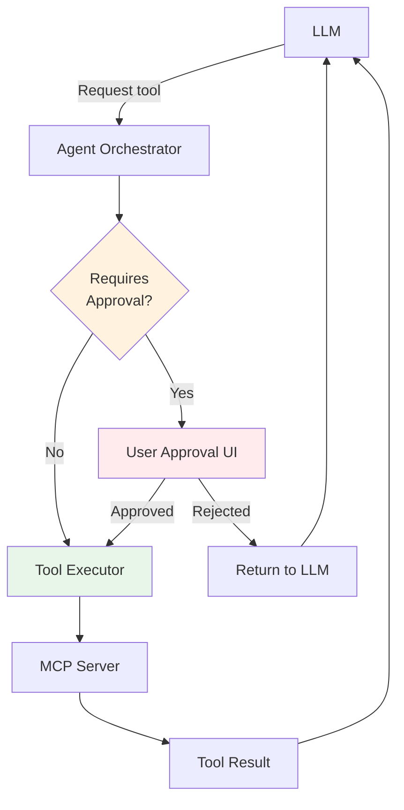
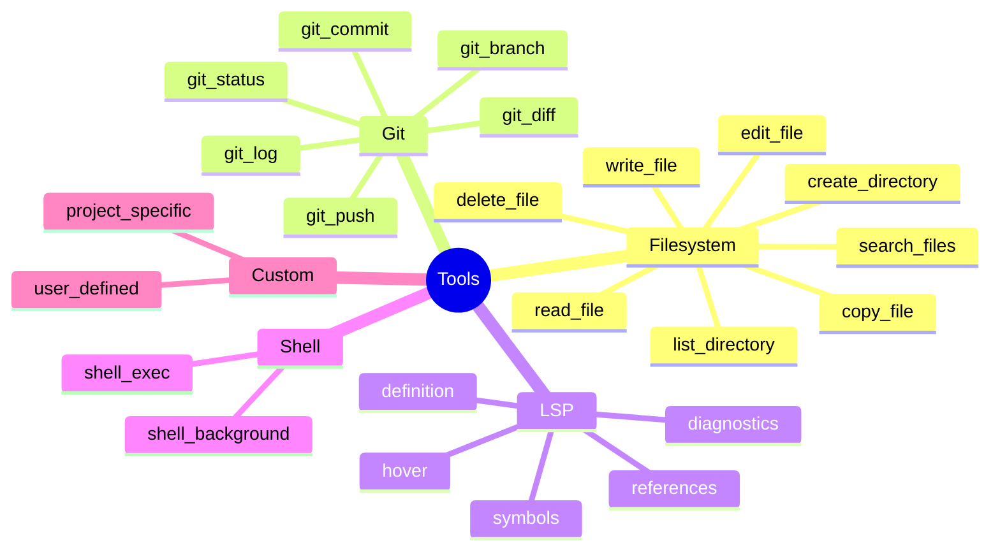
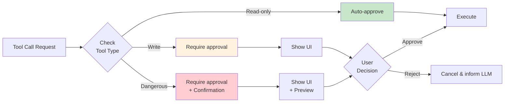
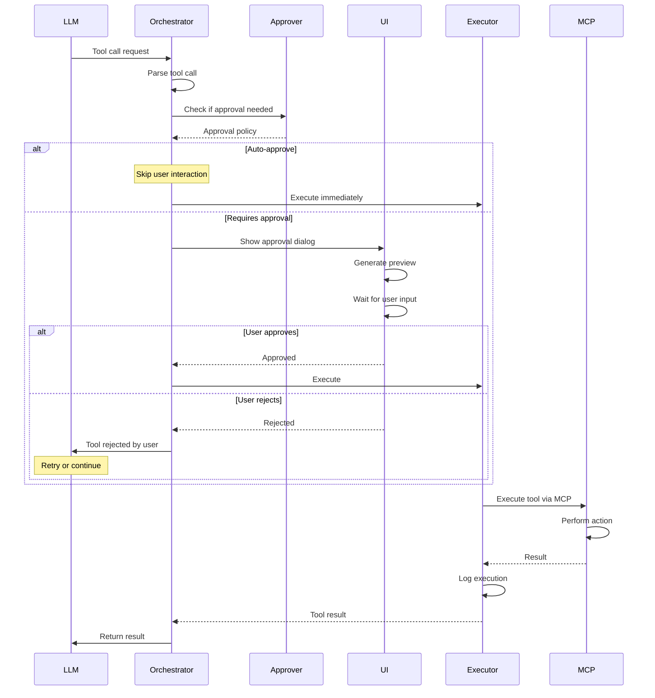
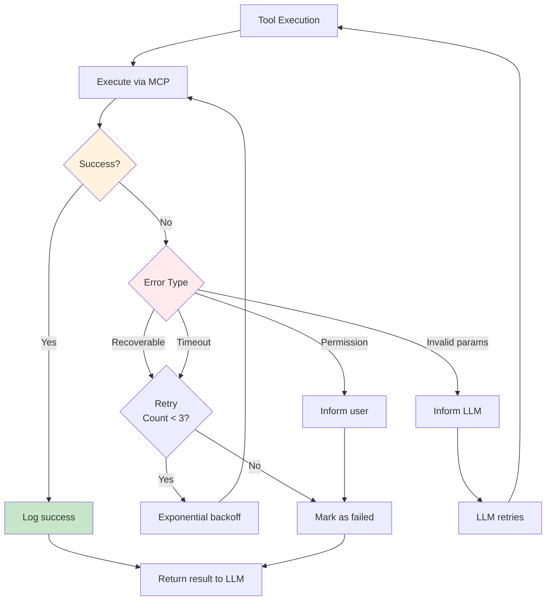
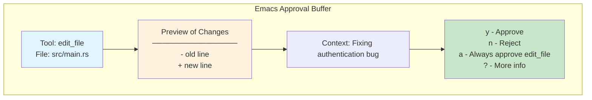
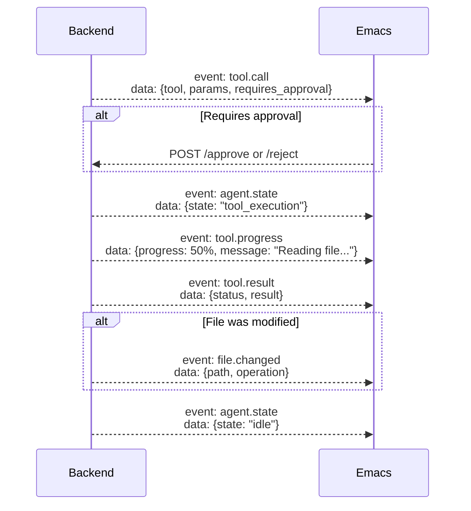

# Tool System

This page documents the tool execution system, including tool categories, approval workflows, and execution flows.

## Overview

The **Tool System** enables the agent to perform actions in the environment through a secure, approval-based workflow.



## Tool Categories

Tools are organized into **categories** based on their domain and purpose.

### Available Tool Categories



### 1. Filesystem Tools

**Purpose:** File and directory operations

| Tool | Description | Approval | Params |
|------|-------------|----------|--------|
| `read_file` | Read file contents | Auto | `path: string` |
| `write_file` | Write content to file | Required | `path: string, content: string` |
| `edit_file` | Edit existing file | Required | `path: string, old: string, new: string` |
| `search_files` | Search for files by pattern | Auto | `pattern: string, path: string` |
| `delete_file` | Delete a file | Required | `path: string` |
| `list_directory` | List directory contents | Auto | `path: string` |
| `create_directory` | Create new directory | Required | `path: string` |
| `copy_file` | Copy file to new location | Required | `source: string, dest: string` |

### 2. Git Tools

**Purpose:** Version control operations

| Tool | Description | Approval | Params |
|------|-------------|----------|--------|
| `git_status` | Show working tree status | Auto | `path: string` |
| `git_diff` | Show changes | Auto | `path: string, staged: bool` |
| `git_commit` | Create commit | Required | `message: string, files: string[]` |
| `git_branch` | List/create branches | Conditional | `name: string, create: bool` |
| `git_log` | Show commit history | Auto | `limit: int, path: string` |
| `git_push` | Push to remote | Required | `remote: string, branch: string` |

### 3. LSP Tools

**Purpose:** Language server protocol integration

| Tool | Description | Approval | Params |
|------|-------------|----------|--------|
| `diagnostics` | Get diagnostics for file | Auto | `path: string` |
| `symbols` | List symbols in file | Auto | `path: string` |
| `hover` | Get hover information | Auto | `path: string, line: int, col: int` |
| `definition` | Go to definition | Auto | `path: string, line: int, col: int` |
| `references` | Find references | Auto | `path: string, line: int, col: int` |

### 4. Shell Tools

**Purpose:** Command execution

| Tool | Description | Approval | Params |
|------|-------------|----------|--------|
| `shell_exec` | Execute command | Required | `command: string, cwd: string` |
| `shell_background` | Run command in background | Required | `command: string, cwd: string` |

## Tool Approval System

### Approval Levels



### Read-Only Tools (Auto-Approve)

These tools are automatically approved without user intervention:

```rust
const READONLY_TOOLS: &[&str] = &[
    // Filesystem
    "read_file",
    "search_files",
    "list_directory",

    // Git
    "git_status",
    "git_diff",
    "git_log",

    // LSP
    "diagnostics",
    "symbols",
    "hover",
    "definition",
    "references",
];
```

### Write Tools (Require Approval)

These tools modify the environment and require explicit user approval:

```rust
const WRITE_TOOLS: &[&str] = &[
    // Filesystem
    "write_file",
    "edit_file",
    "delete_file",
    "create_directory",
    "copy_file",

    // Git
    "git_commit",
    "git_push",
    "git_branch", // when creating

    // Shell
    "shell_exec",
    "shell_background",
];
```

### Dangerous Tools (Extra Confirmation)

These tools require approval with a preview of changes:

```rust
const DANGEROUS_TOOLS: &[&str] = &[
    "delete_file",
    "git_push",
    "shell_exec",
];
```

## Tool Execution Flow

### Complete Execution Flow



### Error Handling Flow



## Tool Approval UI

### Emacs Approval Dialog

The Emacs frontend shows an approval dialog with:

1. **Tool information** - Name, description, parameters
2. **Preview** - What will change (for file operations)
3. **Context** - Where in the conversation this occurred
4. **Actions** - Approve, Reject, Always approve this tool



### Implementation Example

```elisp
(defun emacs-agent-approve-tool (tool-call)
  "Show approval prompt for TOOL-CALL."
  (let* ((tool (alist-get 'tool tool-call))
         (params (alist-get 'params tool-call))
         (preview (emacs-agent--preview-tool-effect tool params))
         (context (alist-get 'context tool-call)))

    ;; Create approval buffer
    (with-current-buffer (get-buffer-create "*Agent Approval*")
      (erase-buffer)
      (insert (format "# Tool Approval Request\n\n"))
      (insert (format "**Tool:** %s\n" tool))
      (insert (format "**Context:** %s\n\n" context))
      (insert "## Preview of Changes\n\n")
      (insert preview)
      (insert "\n\n## Actions\n\n")
      (insert "y - Approve\n")
      (insert "n - Reject\n")
      (insert "a - Always approve this tool\n")
      (insert "? - More information\n")

      (markdown-mode)
      (goto-char (point-min))
      (pop-to-buffer (current-buffer)))

    ;; Wait for user decision
    (let ((decision (read-char-choice
                     "Approve tool? (y/n/a/?) "
                     '(?y ?n ?a ??))))
      (pcase decision
        (?y (emacs-agent-api-approve tool-call))
        (?n (emacs-agent-api-reject tool-call))
        (?a (progn
              (emacs-agent-config-auto-approve tool)
              (emacs-agent-api-approve tool-call)))
        (?? (emacs-agent-show-tool-help tool))))))
```

## Tool Result Format

### Success Result

```json
{
  "status": "success",
  "tool_call_id": "tc_abc123",
  "result": {
    "content": "File written successfully",
    "metadata": {
      "bytes_written": 1024,
      "path": "/path/to/file.rs"
    }
  },
  "execution_time_ms": 15
}
```

### Error Result

```json
{
  "status": "error",
  "tool_call_id": "tc_abc123",
  "error": {
    "code": "PERMISSION_DENIED",
    "message": "Cannot write to /etc/passwd",
    "recoverable": false
  },
  "execution_time_ms": 5
}
```

### Rejected by User

```json
{
  "status": "rejected",
  "tool_call_id": "tc_abc123",
  "reason": "User rejected the operation",
  "user_message": "Wrong file path"
}
```

## Tool Execution Monitoring

### Execution Metrics

The backend tracks tool execution metrics:

```rust
struct ToolMetrics {
    tool_name: String,
    total_calls: u64,
    success_count: u64,
    error_count: u64,
    rejected_count: u64,
    avg_execution_time_ms: f64,
}
```

### Execution Log

Each tool execution is logged:

```rust
struct ToolExecutionLog {
    tool_call_id: String,
    tool_name: String,
    params: serde_json::Value,
    status: ToolStatus,
    result: Option<serde_json::Value>,
    error: Option<String>,
    execution_time_ms: u64,
    timestamp: DateTime<Utc>,
    approved_by: ApprovalSource, // Auto | User | Config
}
```

### Execution Events (SSE)

Tool execution emits several SSE events:



## Custom Tools

Users can create **custom tools** for project-specific operations.

### Custom Tool Definition

```rust
// custom-tools/deploy.rs
use mcp_server::{Tool, Param, ToolResult};

pub fn deploy_tool() -> Tool {
    Tool {
        name: "deploy",
        description: "Deploy application to staging",
        category: "custom",
        parameters: vec![
            Param::required("environment", "string"),
            Param::optional("skip_tests", "bool"),
        ],
        requires_approval: true,
        handler: |args| {
            let env = args.get("environment")?;
            let skip_tests = args.get("skip_tests").unwrap_or(false);

            // Run deployment
            let output = run_deployment(env, skip_tests)?;

            Ok(ToolResult::success(output))
        },
    }
}
```

### Registering Custom Tools

```rust
// Register in MCP server
let mut server = MCPServer::new();
server.register_tool(deploy_tool());
server.register_tool(run_tests_tool());
server.register_tool(database_migration_tool());
```

## Security Considerations

### Sandboxing

MCP servers run in isolated processes:

```rust
fn spawn_mcp_server(config: &MCPServerConfig) -> Result<MCPServer> {
    let mut cmd = Command::new(&config.command);

    // Resource limits
    #[cfg(target_os = "linux")]
    cmd.pre_exec(|| {
        // CPU time limit: 1 hour
        set_rlimit(RLIMIT_CPU, 3600)?;

        // Memory limit: 1GB
        set_rlimit(RLIMIT_AS, 1_000_000_000)?;

        // File descriptor limit: 100
        set_rlimit(RLIMIT_NOFILE, 100)?;

        Ok(())
    });

    // Stdio only - no network access
    cmd.stdin(Stdio::piped())
       .stdout(Stdio::piped())
       .stderr(Stdio::piped());

    let child = cmd.spawn()?;
    Ok(MCPServer { process: child, /* ... */ })
}
```

### Path Validation

All file paths are validated:

```rust
fn validate_path(path: &str, project_root: &Path) -> Result<PathBuf> {
    let canonical = std::fs::canonicalize(path)?;

    // Ensure path is within project
    if !canonical.starts_with(project_root) {
        return Err("Path outside project directory");
    }

    // Deny certain paths
    if is_sensitive_path(&canonical) {
        return Err("Access to sensitive path denied");
    }

    Ok(canonical)
}

fn is_sensitive_path(path: &Path) -> bool {
    let sensitive = [
        "/.env",
        "/credentials.json",
        "/.aws",
        "/.ssh",
    ];

    sensitive.iter().any(|s| path.ends_with(s))
}
```

### Command Validation

Shell commands are validated before execution:

```rust
fn validate_command(cmd: &str) -> Result<()> {
    // Deny dangerous commands
    let dangerous = ["rm -rf /", "dd if=", ":(){ :|:& };:"];
    if dangerous.iter().any(|d| cmd.contains(d)) {
        return Err("Dangerous command blocked");
    }

    // Warn about destructive commands
    let destructive = ["rm ", "mv ", "dd ", "mkfs"];
    if destructive.iter().any(|d| cmd.contains(d)) {
        // Force user approval
        return Ok(/* but mark as requiring approval */);
    }

    Ok(())
}
```

## Performance Optimizations

### Tool Result Caching

Read-only tool results can be cached:

```rust
struct ToolCache {
    cache: HashMap<String, CachedResult>,
}

impl ToolCache {
    fn get(&self, tool: &str, params: &Value) -> Option<Value> {
        let key = format!("{}:{}", tool, params);
        self.cache.get(&key)
            .filter(|r| !r.is_expired())
            .map(|r| r.result.clone())
    }

    fn set(&mut self, tool: &str, params: &Value, result: Value) {
        // Only cache read-only tools
        if READONLY_TOOLS.contains(&tool) {
            let key = format!("{}:{}", tool, params);
            self.cache.insert(key, CachedResult {
                result,
                timestamp: Utc::now(),
                ttl: Duration::from_secs(60),
            });
        }
    }
}
```

### Parallel Tool Execution

Multiple independent tools can execute in parallel:

```rust
async fn execute_tools_parallel(tools: Vec<ToolCall>) -> Vec<ToolResult> {
    let futures: Vec<_> = tools
        .into_iter()
        .map(|tool| execute_tool(tool))
        .collect();

    futures::future::join_all(futures).await
}
```

## Related Pages

- [MCP Integration](MCP-Integration) - MCP protocol and TOON optimization
- [Agent System](Agent-System) - How agents use tools
- [Communication Protocol](Communication-Protocol) - Tool call API
- [Architecture Overview](Architecture-Overview) - System design

## External Resources

- [Model Context Protocol](https://modelcontextprotocol.io/)
- [MCP Tool Specification](https://modelcontextprotocol.io/docs/tools)
- [MCP Security Best Practices](https://modelcontextprotocol.io/docs/security)
