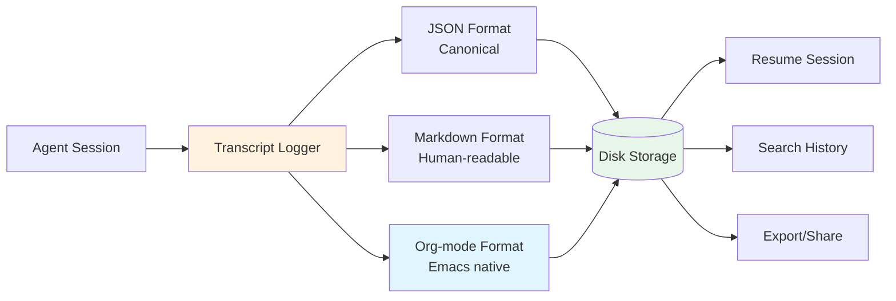
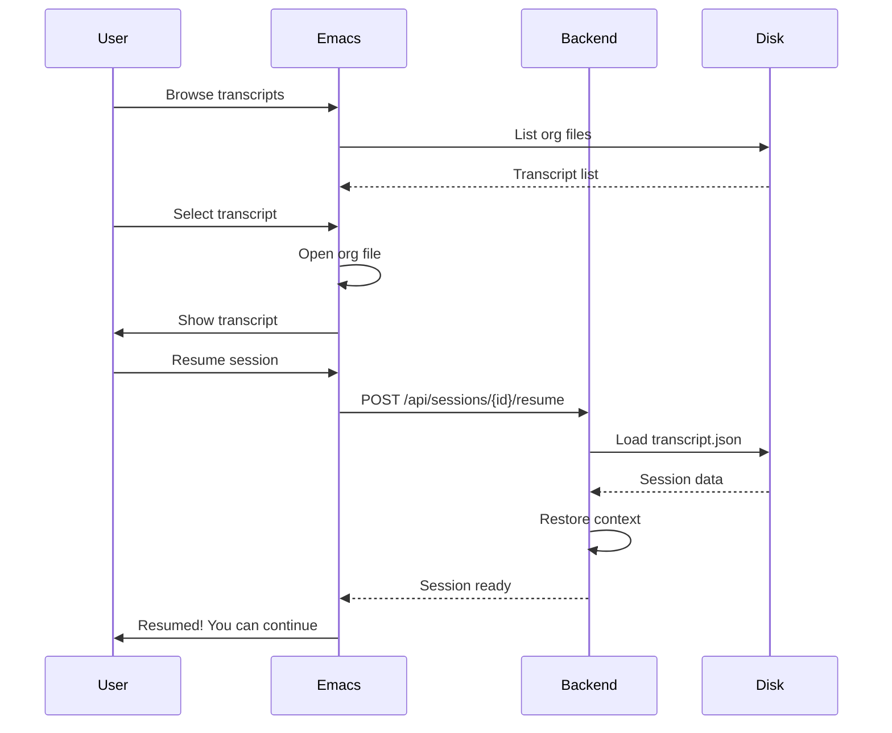

# Transcript Management

This page documents the persistent transcript system that saves all conversations to disk, solving the context loss problem of other AI coding assistants.

## Overview

**Emacs-Agent saves ALL conversations** to disk in multiple formats, enabling:

- **No context loss** - Never lose your conversation history
- **Session resumption** - Resume any past session with full context
- **Searchable history** - Find past conversations and solutions
- **Multiple formats** - JSON (canonical), Markdown (readable), Org-mode (Emacs native)



## Storage Structure

### Directory Layout

```
~/.emacs-agent/transcripts/
└── project-name/
    ├── 2025-11-14/
    │   ├── session-550e8400.json
    │   ├── session-550e8400.md
    │   └── session-550e8400.org
    ├── 2025-11-15/
    │   ├── session-7c9e6679.json
    │   ├── session-7c9e6679.md
    │   └── session-7c9e6679.org
    └── index.json  # Project-level index
```

### Path Pattern

```
{base_path}/{project_name}/{date}/{session_id}.{format}
```

Where:
- **base_path**: `~/.emacs-agent/transcripts/` (configurable)
- **project_name**: Derived from project path (sanitized)
- **date**: `YYYY-MM-DD` format
- **session_id**: UUID
- **format**: `json`, `md`, or `org`

## File Formats

### 1. JSON Format (Canonical)

**Purpose:** Machine-readable format for tools and APIs

```json
{
  "session_id": "550e8400-e29b-41d4-a716-446655440000",
  "project_path": "/home/user/my-project",
  "project_name": "my-project",
  "started_at": "2025-11-14T10:30:00Z",
  "ended_at": "2025-11-14T11:45:00Z",
  "model": "claude-sonnet-4.5",
  "message_count": 23,

  "messages": [
    {
      "role": "user",
      "content": "Implement user authentication",
      "timestamp": "2025-11-14T10:30:05Z"
    },
    {
      "role": "assistant",
      "content": "I'll implement user authentication...",
      "timestamp": "2025-11-14T10:30:15Z"
    }
  ],

  "tool_calls": [
    {
      "tool_call_id": "tc_abc123",
      "tool": "read_file",
      "params": {"path": "src/auth.rs"},
      "result": {"status": "success", "content": "..."},
      "timestamp": "2025-11-14T10:30:20Z"
    }
  ],

  "file_changes": [
    {
      "path": "src/auth.rs",
      "operation": "write",
      "timestamp": "2025-11-14T10:35:00Z"
    }
  ],

  "metadata": {
    "total_tokens": 12450,
    "total_tool_calls": 15,
    "files_modified": 3
  }
}
```

### 2. Markdown Format (Human-Readable)

**Purpose:** Easy reading and sharing

```markdown
# Agent Session - my-project

**Date:** 2025-11-14 10:30:00
**Session ID:** 550e8400-e29b-41d4-a716-446655440000
**Model:** claude-sonnet-4.5
**Duration:** 1h 15m

## Conversation

### User [10:30:05]

Implement user authentication

### Assistant [10:30:15]

I'll implement user authentication. Let me start by analyzing the current code structure.

#### Tool Call: read_file

**Parameters:**
```json
{
  "path": "src/auth.rs"
}
```

**Result:** Success

---

### Assistant [10:35:00]

I've created the authentication system with the following changes:

- Created `src/auth.rs` with login/logout functions
- Added middleware for protected routes
- Updated `src/main.rs` to use authentication

## Files Changed

- `src/auth.rs` (created)
- `src/middleware/auth.rs` (created)
- `src/main.rs` (modified)

## Summary

**Messages:** 23
**Tool Calls:** 15
**Files Modified:** 3
**Total Tokens:** 12,450
```

### 3. Org-mode Format (Emacs Native)

**Purpose:** Native Emacs format for browsing, searching, and organizing

```org
#+TITLE: Agent Session - my-project
#+DATE: 2025-11-14
#+SESSION_ID: 550e8400-e29b-41d4-a716-446655440000
#+MODEL: claude-sonnet-4.5
#+PROJECT: /home/user/my-project

* Conversation

** User [2025-11-14 10:30:05]

Implement user authentication

** Assistant [2025-11-14 10:30:15]

I'll implement user authentication. Let me start by analyzing the current code structure.

*** Tool Call: read_file
:PROPERTIES:
:TOOL_CALL_ID: tc_abc123
:STATUS: success
:END:

#+BEGIN_SRC json
{
  "path": "src/auth.rs"
}
#+END_SRC

*** Result: Success

File contents loaded.

** Assistant [2025-11-14 10:35:00]

I've created the authentication system with the following changes:

- Created [[file:src/auth.rs][src/auth.rs]] with login/logout functions
- Added middleware for protected routes
- Updated [[file:src/main.rs][src/main.rs]] to use authentication

* Files Changed

| File | Operation | Timestamp |
|------|-----------|-----------|
| [[file:src/auth.rs][src/auth.rs]] | create | 2025-11-14 10:32:00 |
| [[file:src/middleware/auth.rs][src/middleware/auth.rs]] | create | 2025-11-14 10:33:00 |
| [[file:src/main.rs][src/main.rs]] | modify | 2025-11-14 10:35:00 |

* Tool Calls

| Tool | Status | Timestamp |
|------|--------|-----------|
| read_file | success | 10:30:20 |
| write_file | success | 10:32:00 |
| write_file | success | 10:33:00 |
| edit_file | success | 10:35:00 |

* Metadata

- Messages: 23
- Tool Calls: 15
- Files Modified: 3
- Total Tokens: 12,450
- Duration: 1h 15m
```

## Implementation

### Rust Backend Logger

```rust
use std::path::{Path, PathBuf};
use chrono::{DateTime, Utc};
use uuid::Uuid;

pub struct TranscriptLogger {
    base_path: PathBuf,
    sessions: HashMap<Uuid, Session>,
}

pub struct Session {
    pub id: Uuid,
    pub project_path: PathBuf,
    pub started_at: DateTime<Utc>,
    pub ended_at: Option<DateTime<Utc>>,
    pub model: String,
    pub messages: Vec<Message>,
    pub tool_calls: Vec<ToolCall>,
    pub file_changes: Vec<FileChange>,
}

impl TranscriptLogger {
    pub fn new(base_path: PathBuf) -> Self {
        Self {
            base_path,
            sessions: HashMap::new(),
        }
    }

    pub fn start_session(&mut self, project_path: PathBuf, model: String) -> Uuid {
        let id = Uuid::new_v4();
        let session = Session {
            id,
            project_path: project_path.clone(),
            started_at: Utc::now(),
            ended_at: None,
            model,
            messages: Vec::new(),
            tool_calls: Vec::new(),
            file_changes: Vec::new(),
        };

        self.sessions.insert(id, session);
        id
    }

    pub fn log_message(&mut self, session_id: Uuid, message: Message) {
        if let Some(session) = self.sessions.get_mut(&session_id) {
            session.messages.push(message);

            // Incremental save (every N messages)
            if session.messages.len() % 10 == 0 {
                let _ = self.save_incremental(session_id);
            }
        }
    }

    pub fn log_tool_call(&mut self, session_id: Uuid, tool_call: ToolCall) {
        if let Some(session) = self.sessions.get_mut(&session_id) {
            session.tool_calls.push(tool_call);
        }
    }

    pub fn end_session(&mut self, session_id: Uuid) -> Result<PathBuf> {
        if let Some(session) = self.sessions.get_mut(&session_id) {
            session.ended_at = Some(Utc::now());
            self.save_all_formats(session_id)?;
        }

        Ok(self.get_transcript_path(session_id, "org"))
    }

    fn save_all_formats(&self, session_id: Uuid) -> Result<()> {
        let session = self.sessions.get(&session_id)
            .ok_or("Session not found")?;

        let dir = self.get_session_dir(session);
        std::fs::create_dir_all(&dir)?;

        // Save in all formats
        self.save_json(session, &dir)?;
        self.save_markdown(session, &dir)?;
        self.save_orgmode(session, &dir)?;

        Ok(())
    }

    fn get_session_dir(&self, session: &Session) -> PathBuf {
        let project_name = self.sanitize_name(
            session.project_path.file_name()
                .unwrap()
                .to_str()
                .unwrap()
        );

        let date = session.started_at.format("%Y-%m-%d").to_string();

        self.base_path
            .join(&project_name)
            .join(&date)
    }

    fn sanitize_name(&self, name: &str) -> String {
        name.chars()
            .map(|c| if c.is_alphanumeric() || c == '-' || c == '_' { c } else { '-' })
            .collect()
    }

    fn save_orgmode(&self, session: &Session, dir: &Path) -> Result<()> {
        let content = self.format_orgmode(session);
        let path = dir.join(format!("session-{}.org", session.id));
        std::fs::write(path, content)?;
        Ok(())
    }

    fn format_orgmode(&self, session: &Session) -> String {
        let project_name = session.project_path.file_name()
            .unwrap()
            .to_str()
            .unwrap();

        format!(
            r#"#+TITLE: Agent Session - {project}
#+DATE: {date}
#+SESSION_ID: {id}
#+MODEL: {model}
#+PROJECT: {project_path}

* Conversation

{messages}

* Files Changed

{files}

* Tool Calls

{tools}

* Metadata

{metadata}
"#,
            project = project_name,
            date = session.started_at.format("%Y-%m-%d"),
            id = session.id,
            model = session.model,
            project_path = session.project_path.display(),
            messages = self.format_messages_org(&session.messages),
            files = self.format_files_org(&session.file_changes),
            tools = self.format_tools_org(&session.tool_calls),
            metadata = self.format_metadata_org(session),
        )
    }
}
```

### Emacs Transcript Viewer

```elisp
(defun emacs-agent-transcript-list ()
  "List all transcripts."
  (interactive)
  (let* ((transcripts-dir (expand-file-name "~/.emacs-agent/transcripts"))
         (transcripts (emacs-agent-transcript--find-all transcripts-dir)))

    (with-current-buffer (get-buffer-create "*Agent Transcripts*")
      (emacs-agent-transcript-list-mode)
      (setq tabulated-list-entries
            (mapcar #'emacs-agent-transcript--format-entry transcripts))
      (tabulated-list-print)
      (pop-to-buffer (current-buffer)))))

(defun emacs-agent-transcript-open (transcript-path)
  "Open TRANSCRIPT-PATH."
  (interactive)
  (find-file transcript-path)
  (org-mode)
  (org-overview))

(defun emacs-agent-transcript-resume (session-id)
  "Resume session SESSION-ID."
  (interactive)
  (emacs-agent-api-resume-session session-id))
```

## Session Resumption

### Resume Flow



### Resume Implementation

```rust
impl TranscriptLogger {
    pub async fn resume_session(&mut self, session_id: Uuid) -> Result<SessionState> {
        // Find transcript file
        let json_path = self.find_transcript(session_id, "json")?;

        // Load JSON
        let content = tokio::fs::read_to_string(json_path).await?;
        let session: Session = serde_json::from_str(&content)?;

        // Restore session state
        let state = SessionState {
            id: session.id,
            messages: session.messages,
            tool_calls: session.tool_calls,
            context: self.rebuild_context(&session),
        };

        // Add back to active sessions
        self.sessions.insert(session_id, session);

        Ok(state)
    }

    fn rebuild_context(&self, session: &Session) -> Context {
        Context {
            project_path: session.project_path.clone(),
            messages: session.messages.clone(),
            // Reconstruct tool schemas from saved tool calls
            available_tools: self.infer_tools(&session.tool_calls),
        }
    }
}
```

## Searching Transcripts

### Search Interface

```elisp
(defun emacs-agent-transcript-search (query)
  "Search transcripts for QUERY."
  (interactive "sSearch transcripts: ")
  (let* ((transcripts-dir (expand-file-name "~/.emacs-agent/transcripts"))
         (results (emacs-agent-transcript--search-all transcripts-dir query)))

    (with-current-buffer (get-buffer-create "*Agent Search Results*")
      (erase-buffer)
      (insert (format "# Search Results for: %s\n\n" query))

      (dolist (result results)
        (insert (format "## %s\n" (plist-get result :file)))
        (insert (format "**Date:** %s\n" (plist-get result :date)))
        (insert (format "**Project:** %s\n\n" (plist-get result :project)))
        (insert (plist-get result :context))
        (insert "\n\n---\n\n"))

      (markdown-mode)
      (goto-char (point-min))
      (pop-to-buffer (current-buffer)))))

(defun emacs-agent-transcript--search-all (dir query)
  "Search all transcripts in DIR for QUERY."
  (let ((org-files (directory-files-recursively dir "\\.org$"))
        (results '()))

    (dolist (file org-files)
      (with-temp-buffer
        (insert-file-contents file)
        (goto-char (point-min))
        (while (search-forward query nil t)
          (let ((context (emacs-agent-transcript--extract-context)))
            (push (list :file file
                       :date (emacs-agent-transcript--extract-date)
                       :project (emacs-agent-transcript--extract-project)
                       :context context)
                  results)))))

    (nreverse results)))
```

### Org-mode Integration

```elisp
(defun emacs-agent-transcript-browse ()
  "Browse transcripts using org-mode agenda."
  (interactive)
  (let ((transcripts-dir (expand-file-name "~/.emacs-agent/transcripts")))
    (setq org-agenda-files
          (directory-files-recursively transcripts-dir "\\.org$"))
    (org-agenda nil "a")))

(defun emacs-agent-transcript-export (session-id format)
  "Export SESSION-ID to FORMAT (html, pdf, etc.)."
  (interactive)
  (let ((org-file (emacs-agent-transcript--find-org session-id)))
    (with-current-buffer (find-file-noselect org-file)
      (pcase format
        ("html" (org-html-export-to-html))
        ("pdf" (org-latex-export-to-pdf))
        ("markdown" (org-md-export-to-markdown))))))
```

## Incremental Saving

To prevent data loss, transcripts are saved incrementally during the session:

```rust
impl TranscriptLogger {
    fn save_incremental(&self, session_id: Uuid) -> Result<()> {
        let session = self.sessions.get(&session_id)?;

        // Write-ahead log (WAL)
        let wal_path = self.get_wal_path(session_id);
        let json_data = serde_json::to_string_pretty(session)?;

        std::fs::write(wal_path, json_data)?;

        Ok(())
    }

    fn get_wal_path(&self, session_id: Uuid) -> PathBuf {
        self.base_path.join(format!(".wal-{}.json", session_id))
    }

    // On startup, recover from WAL
    pub fn recover_from_wal(&mut self) -> Result<()> {
        let wal_files = std::fs::read_dir(&self.base_path)?
            .filter_map(|entry| entry.ok())
            .filter(|entry| {
                entry.file_name()
                    .to_str()
                    .map(|s| s.starts_with(".wal-"))
                    .unwrap_or(false)
            });

        for entry in wal_files {
            let content = std::fs::read_to_string(entry.path())?;
            let session: Session = serde_json::from_str(&content)?;

            // Restore session
            self.sessions.insert(session.id, session);

            // Delete WAL after recovery
            std::fs::remove_file(entry.path())?;
        }

        Ok(())
    }
}
```

## Performance Considerations

### Compression

For large transcripts, enable compression:

```rust
use flate2::write::GzEncoder;
use flate2::Compression;

fn save_compressed(&self, session: &Session, path: &Path) -> Result<()> {
    let json_data = serde_json::to_string_pretty(session)?;

    let file = std::fs::File::create(path.with_extension("json.gz"))?;
    let mut encoder = GzEncoder::new(file, Compression::default());

    encoder.write_all(json_data.as_bytes())?;
    encoder.finish()?;

    Ok(())
}
```

### Lazy Loading

Load only transcript metadata initially:

```rust
struct TranscriptMetadata {
    session_id: Uuid,
    project_name: String,
    started_at: DateTime<Utc>,
    message_count: usize,
    file_path: PathBuf,
}

impl TranscriptLogger {
    fn list_transcripts(&self) -> Vec<TranscriptMetadata> {
        // Read only first few lines of each file
        // to extract metadata without loading full content
    }
}
```

## Related Pages

- [Architecture Overview](Architecture-Overview) - System design
- [Emacs Frontend](Emacs-Frontend) - UI and interaction
- [Rust Backend](Rust-Backend) - Backend implementation
- [Agent System](Agent-System) - Agent orchestration

## External Resources

- [Org-mode Manual](https://orgmode.org/manual/)
- [JSON Specification](https://www.json.org/)
- [Markdown Guide](https://www.markdownguide.org/)
